# postgrejs Benchmarks

_Generated by `npm run bench:report`. Do not hand-edit — re-run the command instead._

## Contents

- [Methodology](#methodology)
  - [Disclosed asymmetries](#disclosed-asymmetries)
- [Environment](#environment)
- [Connection Pooling](#connection-pooling)
  - [Pooled Simple Query](#pooled-simple-query)
  - [Pooled Extended Query](#pooled-extended-query)
  - [Pool Acquire/Release](#pool-acquirerelease)
- [Raw data](#raw-data)

## Methodology

These numbers are produced by `benchmark/` (run via `npm run bench`), comparing postgrejs against `pg` (node-postgres) and `postgres` (postgres.js) on the same server, the same machine, and the same workload. See [benchmark/README.md](./benchmark/README.md) for how to reproduce them.

Each scenario is implemented once per library, using that library's own idiomatic/fastest calling convention — not a shared lowest-common-denominator `query(sql, params)` call — while all three read the exact same SQL text, row counts, and concurrency/pool-size knobs from `benchmark/scenarios/*.ts`. Only the mechanism varies per library, not the workload.

Each `(library, scenario)` pair runs in its own child process, spawned sequentially (never in parallel), to avoid CPU/connection contention skewing numbers and to get clean, uncontaminated V8 JIT warm-up per run. The default matrix runs each pair `--repeats=3` times; the tables below report the **median across repeats**, with intra-run p75/p99 latency and ops/sec from tinybench's own sample statistics.

Each table also reports **GC (ms/op)** and **Peak Heap (KB)** - allocation pressure, not just wall-clock speed. GC (ms/op) is the total time spent in garbage collection during the run (observed via `node:perf_hooks`, every GC pause regardless of cause), divided by the number of timed samples - a proxy for how much garbage a library's own decode/encode path churns through per call, independent of how much of it survives. Peak Heap (KB) is different, and isn't a per-call figure: each worker process is started with `--expose-gc`, forces a clean GC immediately before the run to get a baseline `heapUsed`, then polls `heapUsed` throughout the run and keeps the highest single sample - the most the heap ever grew above that baseline at any point while running the whole scenario, not just what's left over once it's done (a call that allocates a large temporary buffer and frees it before finishing would show a real spike here while still showing near-zero long-term growth). Both include tinybench's own warmup iterations (it doesn't expose a hook at the boundary between warmup and the timed run), and memory measurements are inherently noisier than latency ones - GC timing isn't deterministic and V8's heap growth isn't perfectly linear, so treat these as directional, not to the same precision as the latency columns. (A median-of-samples "typical heap" figure was tried and dropped: for I/O-bound scenarios almost all of the polled samples land during idle network wait rather than the brief allocation burst, so the median collapsed to ~0 even on runs with a real, multi-hundred-KB peak - it doesn't have a reliable per-call interpretation the way Peak Heap does.)

Two scenarios - Large Blob Fetch and Large Array Fetch - additionally report **Network (KB/op)**: the bytes the server actually sent, per call, counted at the socket (`Readable.push()`, so all three libraries are measured identically rather than through any library's own accounting). It is reported only there because that is where it separates the libraries: postgrejs reads those columns in the binary protocol while pg and postgres.js read them as text, and the same rows cost very different amounts on the wire in the two formats. A `bytea` costs exactly twice as much as text (`\x`-prefixed hex, two characters per byte), while an `int4[]` depends entirely on the values - binary spends a fixed 8 bytes per element (4-byte length prefix + 4-byte value) where text spends one byte per digit, so full-width int4s favour binary and values near zero favour text. Everywhere else the payload is small and near-identical across libraries, so the number would be noise rather than information.

### Disclosed asymmetries

Some scenarios necessarily exercise each library differently. These are deliberate, not oversights:

1. **Pool concurrency** — each library's own top-level entry point is called N times at a fixed concurrency with pool max size held equal (`pg.Pool`'s explicit connect/release, postgres.js's implicit auto-pipelined pool, postgrejs's `Pool.execute()`). postgres.js's automatic pipelining is measured as a real feature, not normalized away — and postgrejs is given the same ability, but it has to ask: pipelining is opt-in per call there (`pipeline: true`), not the default, so this scenario passes it. The reason it is opt-in is a real trade rather than caution: PostgreSQL runs a connection's statements one at a time, so sharing a connection speeds up bursts of short queries but lets one slow query delay whatever is queued behind it. pg has no equivalent and runs one query per connection throughout, which is most of why it trails here.
2. **Cursor streaming** — `pg` has no built-in cursor API; its scenario emulates one with raw `DECLARE CURSOR` / `FETCH n` / `CLOSE` SQL via `client.query()` (no `pg-cursor` dependency). This is an emulation, not `pg`'s native path.
3. **Prepared-statement reuse** — postgres.js auto-prepares/caches transparently, `pg` uses a named statement, postgrejs uses explicit `prepare()`/`execute()`/`close()`. Same SQL text and iteration count across all three; the three different mechanisms are shown side by side rather than forced into one shape.
4. **Type decoding** — no custom type parsers/overrides for any library; each uses its own default config (e.g. `pg` returns `int8` as a string by default, postgres.js as `BigInt`). This is the fairest and most representative choice; differing default row shapes are an interpretation footnote, not something to fix.
5. **Row shape** — postgrejs's `objectRows` option is explicitly set `true` in every scenario so its output shape (object rows) matches `pg`'s and postgres.js's defaults; otherwise postgrejs would gain an artificial edge from skipping key-mapping work the other two always do. This is the one deliberate normalization, called out as such.
6. **Transport** — all three connect via TCP to the same Postgres instance (no Unix-socket path is exercised).
7. **`pg-native` is out of scope for v1** — it requires a system libpq + native compilation, not guaranteed on CI/contributor machines. It can be added later behind an opt-in `--lib=pg-native` flag without ever being in the default matrix.
8. **`pg`'s wire pipelining** — `pg` 8.23+ added an opt-in `pipeline: true` client option (send multiple queries without waiting for each one's response before writing the next), off by default. Every `*-concurrent` scenario here fires N queries via `Promise.all()` without awaiting each individually - exactly the pattern this flag is for - so it's enabled for `pg`'s client here; leaving it off would benchmark its serialized fallback path instead of its real concurrent capability, understating it the same way testing postgrejs/postgres.js without their own pipelining would. It's a no-op for every sequential (always-awaited-one-at-a-time) scenario.

## Environment

- Run date: 2026-09-05T18:57:11.315Z
- Node.js: v24.15.0
- OS: Darwin 25.5.0 (darwin/arm64)
- CPU: Apple M1 Pro (10 logical cores)
- RAM: 16.0 GB total
- PostgreSQL: PostgreSQL 18.4 on aarch64-unknown-linux-musl, compiled by gcc (Alpine 15.2.0) 15.2.0, 64-bit
- Library versions (installed, not this repo's semver range): postgrejs 2.23.1, pg 8.23.0, postgres 3.4.9

## Connection Pooling

The overhead each library's connection pool adds on top of the raw per-query costs measured above: running many queries concurrently through a shared pool (postgrejs's `Pool.query()`), and isolating the pure cost of acquiring and releasing a pooled connection from the cost of the query itself.

### Pooled Simple Query

Same query as Sequential Execution/Concurrent Execution above, run through a pool instead of a single open connection: 1000 concurrent `select 1 as one` queries against a pool of max size 10, using each library's own top-level pooled entry point (concurrency=1000, poolSize=10)

| Library | Mean (ms) | p75 (ms) | p99 (ms) | ops/sec | vs. slowest | GC (ms/op) | Peak Heap (KB) |
|---|---:|---:|---:|---:|---:|---:|---:|
| PostgreJS (2.23.1) | ***17.597*** | ***16.292*** | ***67.881*** | ***64.2*** | ***5.72x*** | 1.8269 | 37938.59 |
| postgres (postgres.js) (3.4.9) | 24.338 | 24.990 | 94.021 | 51.4 | 4.14x | 1.9776 | 42390.48 |
| pg (node-postgres) (8.23.0) | 100.696 | 106.283 | 143.511 | 10.3 | 1.00x | ***1.8116*** | ***11601.96*** |

<table border="0" style="border:none;border-collapse:collapse;border-spacing:2px;">
<tr style="border:none;"><td style="border:none;margin:0;padding:4px;">

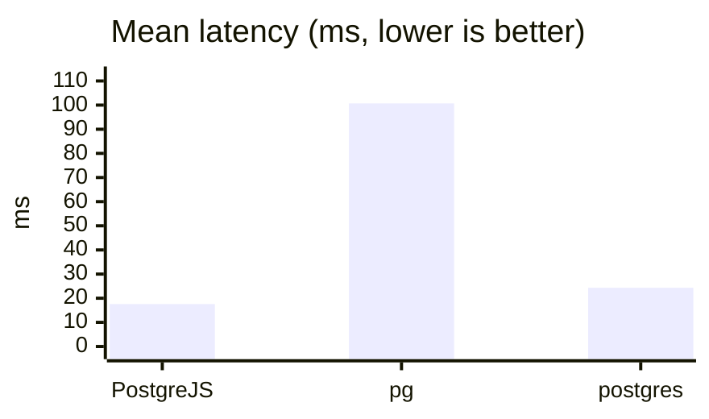

</td><td style="border:none;margin:0;padding:4px;">

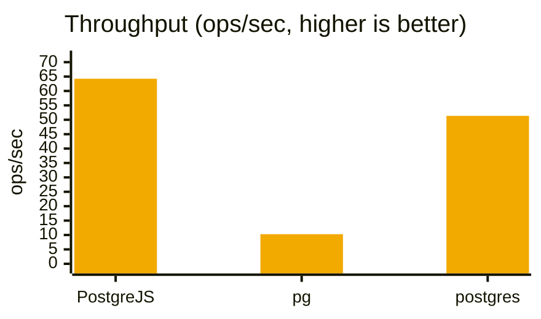

</td></tr>
<tr style="border:none;"><td style="border:none;margin:0;padding:4px;">

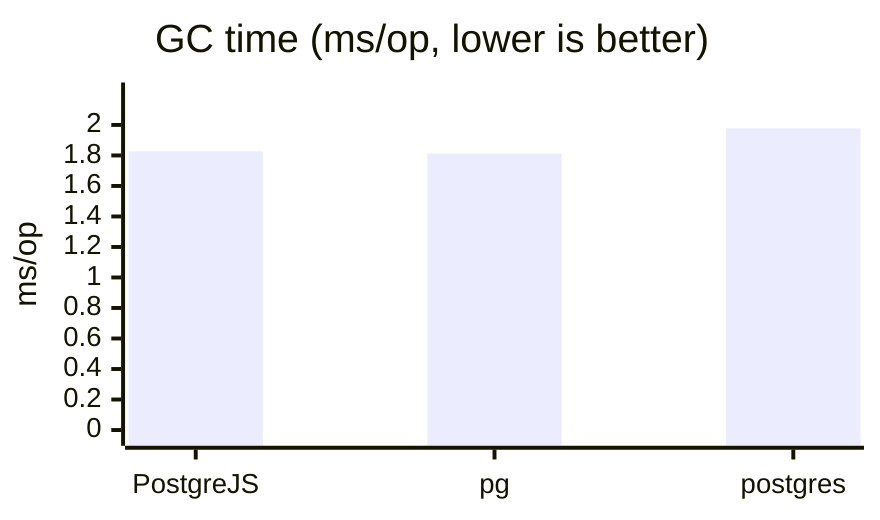

</td><td style="border:none;margin:0;padding:4px;">

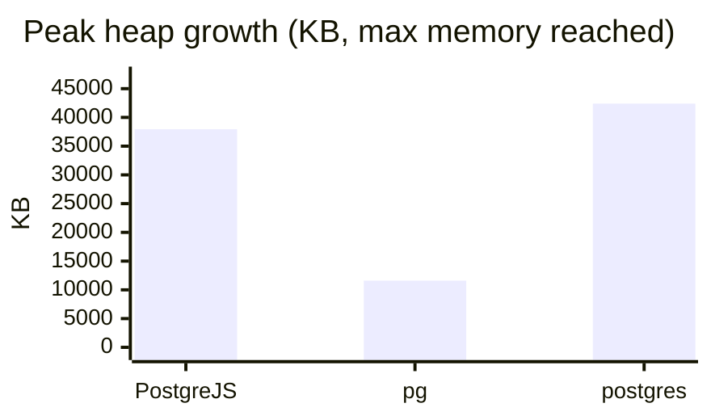

</td></tr>
</table>

### Pooled Extended Query

The Extended Query counterpart to Pooled Simple Query above: the same 1000 concurrent calls against a pool of max size 10, but binding a real query parameter (`select $1::int2 as one`) so every library goes through Parse/Bind/Describe/Execute/Sync instead of a single Query message. Each call is a one-shot statement, not a reused prepared one, so this shows what a pool costs on top of the per-call Extended Query overhead - compare it against this group's Pooled Simple Query to see what the extra protocol round of messages adds once connections are being shared. Read the margin here with that one-shot constraint in mind: postgres.js's unprepared path (`sql.unsafe(query, args)`, the same call the single-connection Sequential Execution scenario uses, where it comes out ahead) does not pipeline a burst the way its prepared path does - letting it cache the statement instead turns this into a different measurement entirely, which is what Prepared Statement Reuse below covers (concurrency=1000, poolSize=10)

| Library | Mean (ms) | p75 (ms) | p99 (ms) | ops/sec | vs. slowest | GC (ms/op) | Peak Heap (KB) |
|---|---:|---:|---:|---:|---:|---:|---:|
| PostgreJS (2.23.1) | ***29.713*** | ***32.322*** | ***76.375*** | ***38.6*** | ***8.86x*** | 2.7815 | 35637.52 |
| pg (node-postgres) (8.23.0) | 157.922 | 131.934 | 298.131 | 7.3 | 1.67x | ***2.4340*** | ***11211.19*** |
| postgres (postgres.js) (3.4.9) | 263.219 | 286.345 | 294.171 | 3.8 | 1.00x | 2.8692 | 15821.24 |

<table border="0" style="border:none;border-collapse:collapse;border-spacing:2px;">
<tr style="border:none;"><td style="border:none;margin:0;padding:4px;">

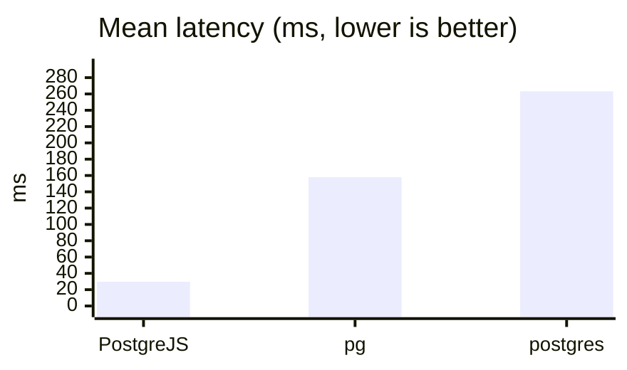

</td><td style="border:none;margin:0;padding:4px;">

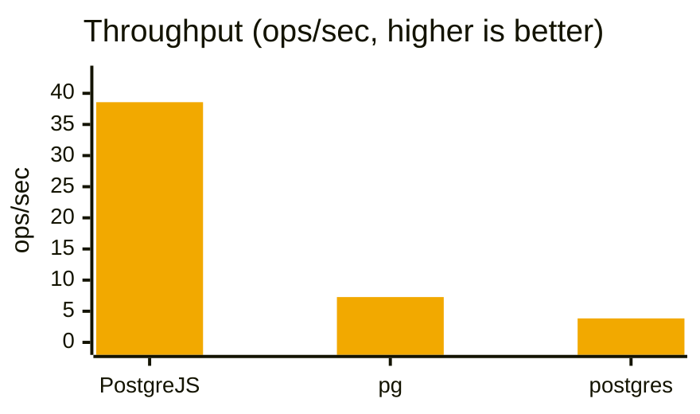

</td></tr>
<tr style="border:none;"><td style="border:none;margin:0;padding:4px;">

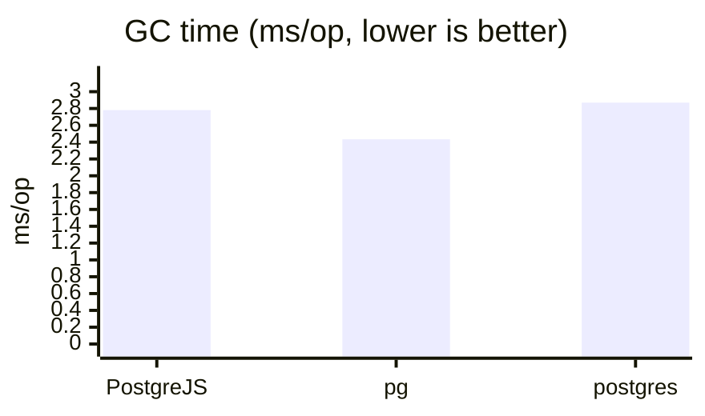

</td><td style="border:none;margin:0;padding:4px;">

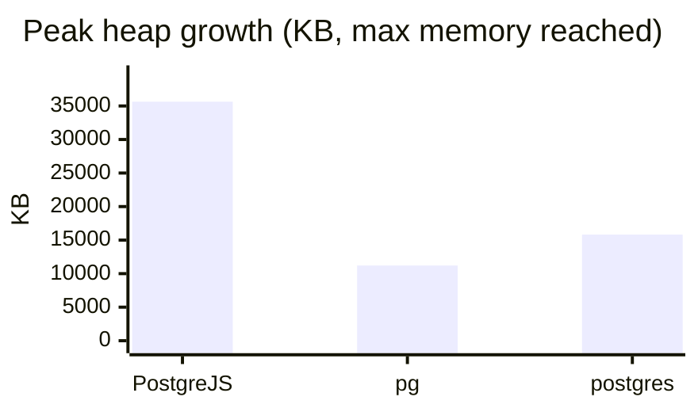

</td></tr>
</table>

### Pool Acquire/Release

Acquire and immediately release a connection 1000 times concurrently against a pool of max size 10, no query run - isolates pool overhead from query overhead (concurrency=1000, poolSize=10)

| Library | Mean (ms) | p75 (ms) | p99 (ms) | ops/sec | vs. slowest | GC (ms/op) | Peak Heap (KB) |
|---|---:|---:|---:|---:|---:|---:|---:|
| pg (node-postgres) (8.23.0) | ***0.792*** | 0.738 | ***1.579*** | 1326.4 | ***1.45x*** | ***0.0179*** | ***10809.73*** |
| postgres (postgres.js) (3.4.9) | 0.804 | ***0.641*** | 3.122 | ***1500.9*** | 1.43x | 0.1447 | 115774.39 |
| PostgreJS (2.23.1) | 1.150 | 0.907 | 4.214 | 1046.7 | 1.00x | 0.2173 | 193963.02 |

<table border="0" style="border:none;border-collapse:collapse;border-spacing:2px;">
<tr style="border:none;"><td style="border:none;margin:0;padding:4px;">

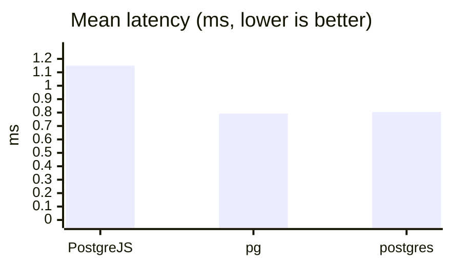

</td><td style="border:none;margin:0;padding:4px;">

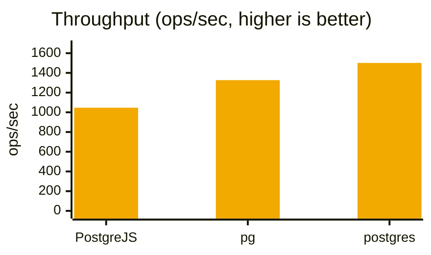

</td></tr>
<tr style="border:none;"><td style="border:none;margin:0;padding:4px;">

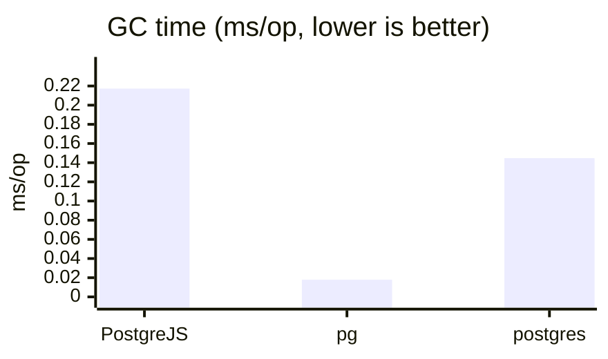

</td><td style="border:none;margin:0;padding:4px;">

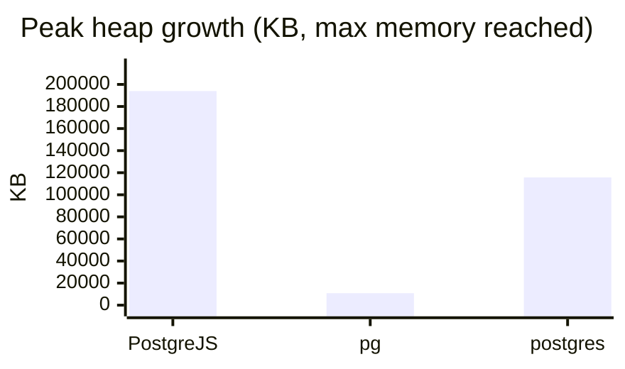

</td></tr>
</table>

## Raw data

Backing raw data for the numbers above lives in `benchmark/results/*.json` (gitignored; regenerate with `npm run bench`).
