# PostgreJS Benchmarks

_Generated by `npm run bench:report`. Do not hand-edit — re-run the command instead._

## Contents

- [Methodology](#methodology)
  - [Disclosed asymmetries](#disclosed-asymmetries)
- [Environment](#environment)
- [Connection](#connection)
  - [Connect](#connect)
- [Simple Query](#simple-query)
  - [Sequential Execution](#sequential-execution)
  - [Concurrent Execution](#concurrent-execution)
  - [Simple Query Fetch](#simple-query-fetch)
- [Extended Query](#extended-query)
  - [Sequential Execution](#sequential-execution-1)
  - [Concurrent Execution](#concurrent-execution-1)
  - [Mixed-Type Decode (Text Protocol)](#mixed-type-decode-text-protocol)
  - [Mixed-Type Decode (Binary Protocol)](#mixed-type-decode-binary-protocol)
  - [Large Blob Fetch](#large-blob-fetch)
  - [Large Array Fetch](#large-array-fetch)
  - [Prepared Statement Reuse (Sequential)](#prepared-statement-reuse-sequential)
  - [Prepared Statement Reuse (Concurrent)](#prepared-statement-reuse-concurrent)
- [Cursor Streaming](#cursor-streaming)
  - [Cursor Streaming](#cursor-streaming-1)
- [Connection Pooling](#connection-pooling)
  - [Pooled Simple Query](#pooled-simple-query)
  - [Pooled Extended Query](#pooled-extended-query)
- [Raw data](#raw-data)

## Methodology

These numbers are produced by `benchmark/` (run via `npm run bench`), comparing PostgreJS against `pg` (node-postgres) and `postgres` (postgres.js) on the same server, the same machine, and the same workload. See [benchmark/README.md](./benchmark/README.md) for how to reproduce them.

Each scenario is implemented once per library, using that library's own idiomatic/fastest calling convention — not a shared lowest-common-denominator `query(sql, params)` call — while all three read the exact same SQL text, row counts, and concurrency/pool-size knobs from `benchmark/scenarios/*.ts`. Only the mechanism varies per library, not the workload.

Each `(library, scenario)` pair runs in its own child process, spawned sequentially (never in parallel), to avoid CPU/connection contention skewing numbers and to get clean, uncontaminated V8 JIT warm-up per run. The default matrix runs each pair `--repeats=3` times; the tables below report the **median across repeats**, with intra-run p75/p99 latency and ops/sec from tinybench's own sample statistics.

Each table also reports **GC (ms/op)** and **Peak Heap (KB)** - allocation pressure, not just wall-clock speed. GC (ms/op) is the total time spent in garbage collection during the run (observed via `node:perf_hooks`, every GC pause regardless of cause), divided by the number of timed samples - a proxy for how much garbage a library's own decode/encode path churns through per call, independent of how much of it survives. Peak Heap (KB) is different, and isn't a per-call figure: each worker process is started with `--expose-gc`, forces a clean GC immediately before the run to get a baseline `heapUsed`, then polls `heapUsed` throughout the run and keeps the highest single sample - the most the heap ever grew above that baseline at any point while running the whole scenario, not just what's left over once it's done (a call that allocates a large temporary buffer and frees it before finishing would show a real spike here while still showing near-zero long-term growth). Both include tinybench's own warmup iterations (it doesn't expose a hook at the boundary between warmup and the timed run), and memory measurements are inherently noisier than latency ones - GC timing isn't deterministic and V8's heap growth isn't perfectly linear, so treat these as directional, not to the same precision as the latency columns. (A median-of-samples "typical heap" figure was tried and dropped: for I/O-bound scenarios almost all of the polled samples land during idle network wait rather than the brief allocation burst, so the median collapsed to ~0 even on runs with a real, multi-hundred-KB peak - it doesn't have a reliable per-call interpretation the way Peak Heap does.)

Two scenarios - Large Blob Fetch and Large Array Fetch - additionally report **Network (KB/op)**: the bytes the server actually sent, per call, counted at the socket (`Readable.push()`, so all three libraries are measured identically rather than through any library's own accounting). It is reported only there because that is where it separates the libraries: PostgreJS reads those columns in the binary protocol while pg and postgres.js read them as text, and the same rows cost very different amounts on the wire in the two formats. A `bytea` costs exactly twice as much as text (`\x`-prefixed hex, two characters per byte), while an `int4[]` depends entirely on the values - binary spends a fixed 8 bytes per element (4-byte length prefix + 4-byte value) where text spends one byte per digit, so full-width int4s favour binary and values near zero favour text. Everywhere else the payload is small and near-identical across libraries, so the number would be noise rather than information.

### Disclosed asymmetries

Some scenarios necessarily exercise each library differently. These are deliberate, not oversights:

1. **Pool concurrency** — each library's own top-level entry point is called N times at a fixed concurrency with pool max size held equal (`pg.Pool`'s explicit connect/release, postgres.js's implicit auto-pipelined pool, PostgreJS's `Pool.execute()`). postgres.js's automatic pipelining is measured as a real feature, not normalized away — and postgrejs is given the same ability, but it has to ask: pipelining is opt-in per call there (`pipeline: true`), not the default, so this scenario passes it. The reason it is opt-in is a real trade rather than caution: PostgreSQL runs a connection's statements one at a time, so sharing a connection speeds up bursts of short queries but lets one slow query delay whatever is queued behind it. pg has no equivalent and runs one query per connection throughout, which is most of why it trails here.
2. **Cursor streaming** — `pg` has no built-in cursor API; its scenario emulates one with raw `DECLARE CURSOR` / `FETCH n` / `CLOSE` SQL via `client.query()` (no `pg-cursor` dependency). This is an emulation, not `pg`'s native path.
3. **Prepared-statement reuse** — postgres.js auto-prepares/caches transparently, `pg` uses a named statement, PostgreJS uses explicit `prepare()`/`execute()`/`close()`. Same SQL text and iteration count across all three; the three different mechanisms are shown side by side rather than forced into one shape.
4. **Type decoding** — no custom type parsers/overrides for any library; each uses its own default config (e.g. `pg` returns `int8` as a string by default, postgres.js as `BigInt`). This is the fairest and most representative choice; differing default row shapes are an interpretation footnote, not something to fix.
5. **Row shape** — PostgreJS's `objectRows` option is explicitly set `true` in every scenario so its output shape (object rows) matches `pg`'s and postgres.js's defaults; otherwise postgrejs would gain an artificial edge from skipping key-mapping work the other two always do. This is the one deliberate normalization, called out as such.
6. **Transport** — all three connect via TCP to the same Postgres instance (no Unix-socket path is exercised).
7. **`pg-native` is out of scope for v1** — it requires a system libpq + native compilation, not guaranteed on CI/contributor machines. It can be added later behind an opt-in `--lib=pg-native` flag without ever being in the default matrix.
8. **`pg`'s wire pipelining** — `pg` 8.23+ added an opt-in `pipeline: true` client option (send multiple queries without waiting for each one's response before writing the next), off by default. Every `*-concurrent` scenario here fires N queries via `Promise.all()` without awaiting each individually - exactly the pattern this flag is for - so it's enabled for `pg`'s client here; leaving it off would benchmark its serialized fallback path instead of its real concurrent capability, understating it the same way testing PostgreJS/postgres.js without their own pipelining would. It's a no-op for every sequential (always-awaited-one-at-a-time) scenario.

## Environment

- Run date: 2026-09-06T17:36:44.688Z
- Node.js: v24.15.0
- OS: Darwin 25.5.0 (darwin/arm64)
- CPU: Apple M1 Pro (10 logical cores)
- RAM: 16.0 GB total
- PostgreSQL: PostgreSQL 18.4 on aarch64-unknown-linux-musl, compiled by gcc (Alpine 15.2.0) 15.2.0, 64-bit
- Library versions (installed, not this repo's semver range): PostgreJS 3.0.0, pg 8.23.0, postgres 3.4.9

## Connection

The fixed cost of opening (and closing) a connection - the TCP handshake, PostgreSQL startup/auth handshake, and `ReadyForQuery`, paid once per connection lifetime rather than once per query.

### Connect

Open a fresh connection/session and close it, repeated per sample

| Library | Mean (ms) | p75 (ms) | p99 (ms) | ops/sec | vs. slowest | GC (ms/op) | Peak Heap (KB) |
|---|---:|---:|---:|---:|---:|---:|---:|
| PostgreJS (3.0.0) | ***5.918*** | ***6.148*** | ***11.552*** | ***175.6*** | ***3.04x*** | ***0.0371*** | 4449.95 |
| pg (node-postgres) (8.23.0) | 8.336 | 8.696 | 14.714 | 123.8 | 2.16x | 0.0394 | ***2247.02*** |
| postgres (postgres.js) (3.4.9) | 18.015 | 18.229 | 25.995 | 56.4 | 1.00x | 0.2432 | 8537.90 |

<table border="0" style="border:none;border-collapse:collapse;border-spacing:2px;">
<tr style="border:none;"><td style="border:none;margin:0;padding:4px;">

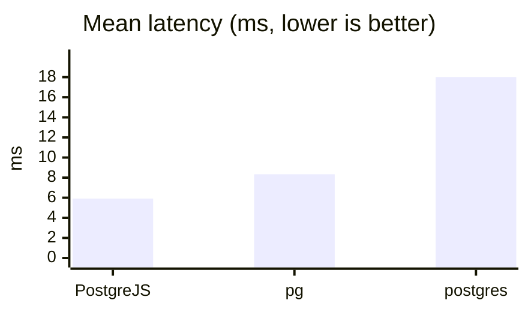

</td><td style="border:none;margin:0;padding:4px;">


</td></tr>
<tr style="border:none;"><td style="border:none;margin:0;padding:4px;">

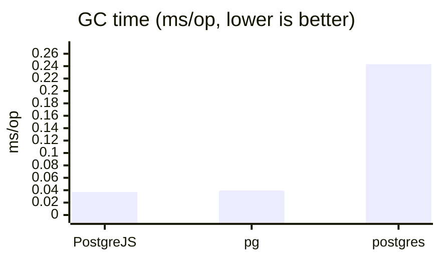

</td><td style="border:none;margin:0;padding:4px;">

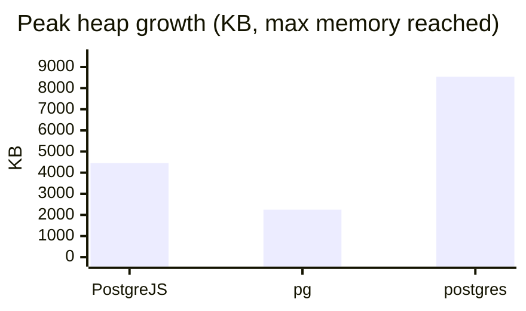

</td></tr>
</table>

## Simple Query

PostgreSQL's Simple Query sub-protocol: the client sends the SQL text as a single `Query` (`Q`) message and the server parses, plans, executes, and streams the results back in that same round trip - no separate parse/bind/describe/execute/sync steps, and no query parameters. In postgrejs this is `Connection.execute(sql)`. It's the cheapest way to run a query the client isn't going to reuse, which is why it's also the baseline every other protocol group below is compared against. It's distinct from the Extended Query group below: Extended Query trades this single round trip for several (parse, bind, describe, execute, sync) in exchange for bind parameters and a statement the server can plan once and re-execute. The scenarios here measure that Simple Query round trip three ways: a single query on an otherwise-idle connection, many queries fired concurrently over one connection, and one query that fetches many rows.

### Sequential Execution

Run `select 1` one call at a time on an already-open connection.
Each call is fully awaited before the next one starts.

Every library uses its genuine Simple Query path: PostgreJS's execute(),
pg's query(text) with no params, postgres.js's unsafe() with no args -
always a real Simple Query message, regardless of any prepare option.

This is the baseline for the group: one round trip's plain cost, with no
concurrency, no pooling, and no bind parameters. Compare it against
Concurrent Execution below to see what overlapping calls on the same
connection buys each library.

| Library | Mean (ms) | p75 (ms) | p99 (ms) | ops/sec | vs. slowest | GC (ms/op) | Peak Heap (KB) |
|---|---:|---:|---:|---:|---:|---:|---:|
| PostgreJS (3.0.0) | ***0.260*** | ***0.276*** | ***0.658*** | ***4266.0*** | ***1.28x*** | ***0.0011*** | ***5570.63*** |
| pg (node-postgres) (8.23.0) | 0.278 | 0.302 | 0.819 | 4088.0 | 1.19x | 0.0017 | 9898.94 |
| postgres (postgres.js) (3.4.9) | 0.332 | 0.343 | 1.210 | 3754.8 | 1.00x | 0.0023 | 9117.09 |

<table border="0" style="border:none;border-collapse:collapse;border-spacing:2px;">
<tr style="border:none;"><td style="border:none;margin:0;padding:4px;">

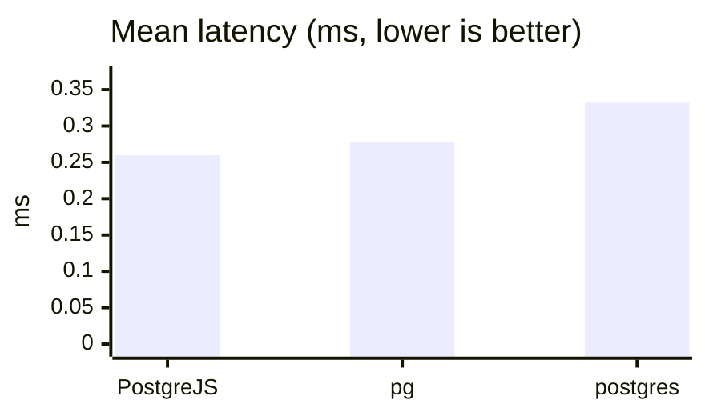

</td><td style="border:none;margin:0;padding:4px;">

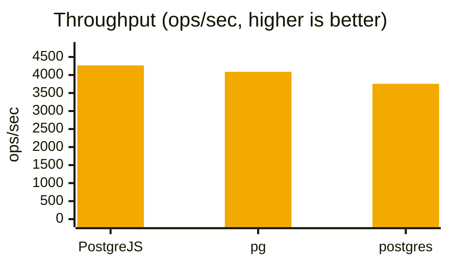

</td></tr>
<tr style="border:none;"><td style="border:none;margin:0;padding:4px;">


</td><td style="border:none;margin:0;padding:4px;">

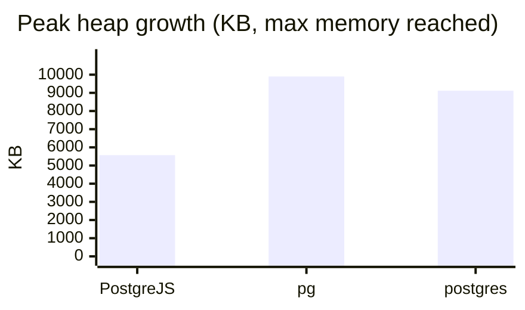

</td></tr>
</table>

### Concurrent Execution

The concurrent counterpart to Sequential Execution above. Fire
50 Simple Query calls on the SAME
already-open connection without awaiting each one individually, then await
them all via Promise.all().

PostgreJS pipelines these at the wire level: it writes each message without
waiting for the previous one's response, then matches responses back in
FIFO order, so results never cross-talk even though the caller never
awaited between calls.

Each call selects a distinct literal and checks the result against it, so
this scenario verifies correctness too - do the other libraries' single
connections queue/pipeline correctly? - not just timing. (concurrency=50)

| Library | Mean (ms) | p75 (ms) | p99 (ms) | ops/sec | vs. slowest | GC (ms/op) | Peak Heap (KB) |
|---|---:|---:|---:|---:|---:|---:|---:|
| pg (node-postgres) (8.23.0) | ***2.416*** | ***2.519*** | ***3.844*** | ***421.6*** | ***1.42x*** | 0.0292 | 19673.70 |
| PostgreJS (3.0.0) | 3.061 | 3.475 | 4.946 | 343.1 | 1.12x | ***0.0246*** | ***9251.61*** |
| postgres (postgres.js) (3.4.9) | 3.428 | 3.593 | 5.371 | 318.4 | 1.00x | 0.0703 | 28344.79 |

<table border="0" style="border:none;border-collapse:collapse;border-spacing:2px;">
<tr style="border:none;"><td style="border:none;margin:0;padding:4px;">

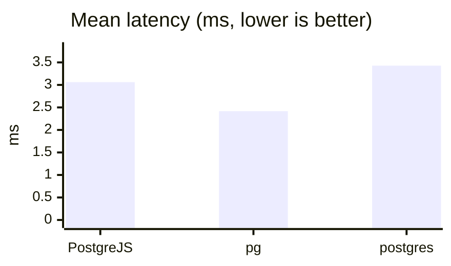

</td><td style="border:none;margin:0;padding:4px;">

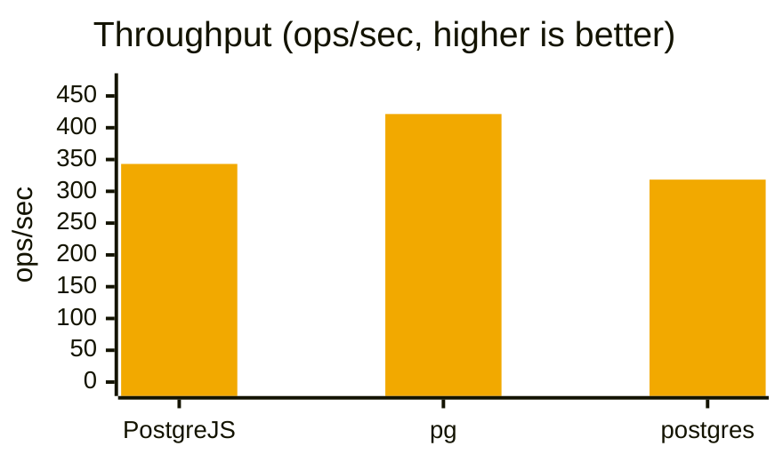

</td></tr>
<tr style="border:none;"><td style="border:none;margin:0;padding:4px;">

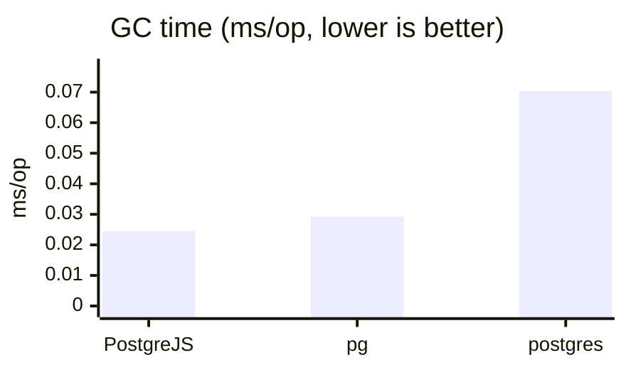

</td><td style="border:none;margin:0;padding:4px;">

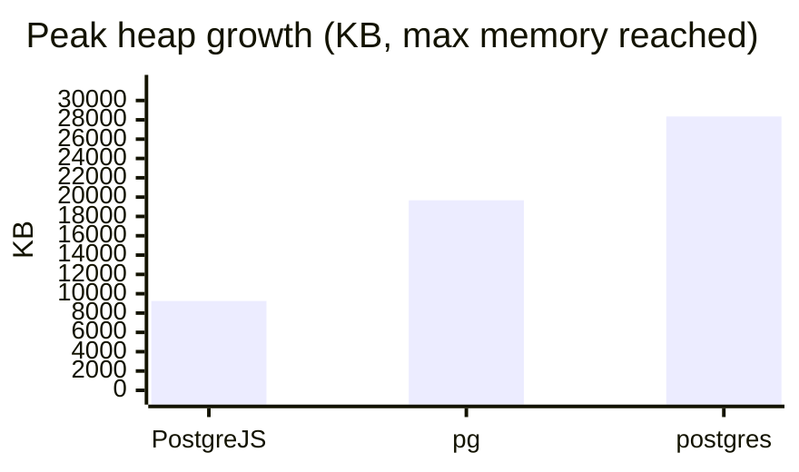

</td></tr>
</table>

### Simple Query Fetch

Fetch 1000 mixed-type rows via each
library's Simple Query path - the same protocol as Sequential Execution and
Concurrent Execution above - on a single already-open connection, no pool.
This measures row-fetch throughput without the parse/bind/describe
overhead of the Extended Query protocol.

Excludes int8: pg, postgres.js and PostgreJS return it as genuinely
different JS types by default (string, BigInt, number-or-BigInt). Timing
that column would measure type-conversion choice, not decode speed. (rowTarget=1000)

| Library | Mean (ms) | p75 (ms) | p99 (ms) | ops/sec | vs. slowest | GC (ms/op) | Peak Heap (KB) |
|---|---:|---:|---:|---:|---:|---:|---:|
| PostgreJS (3.0.0) | ***2.647*** | ***2.774*** | ***4.332*** | ***384.2*** | ***1.68x*** | ***0.0599*** | ***8917.99*** |
| postgres (postgres.js) (3.4.9) | 3.461 | 3.481 | 8.823 | 302.6 | 1.28x | 0.3011 | 53415.38 |
| pg (node-postgres) (8.23.0) | 4.440 | 4.560 | 9.502 | 237.5 | 1.00x | 0.4234 | 54582.75 |

<table border="0" style="border:none;border-collapse:collapse;border-spacing:2px;">
<tr style="border:none;"><td style="border:none;margin:0;padding:4px;">

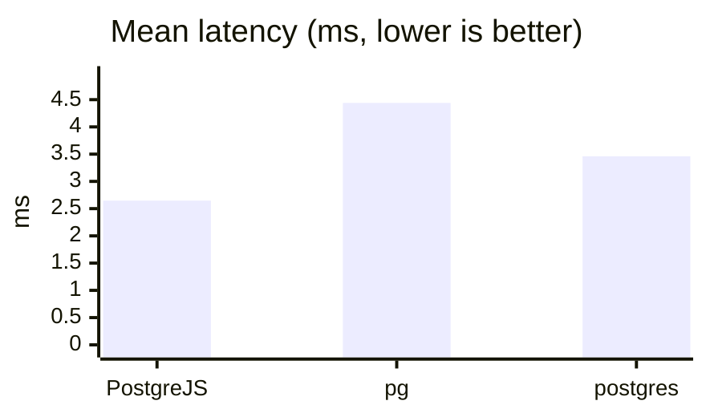

</td><td style="border:none;margin:0;padding:4px;">


</td></tr>
<tr style="border:none;"><td style="border:none;margin:0;padding:4px;">

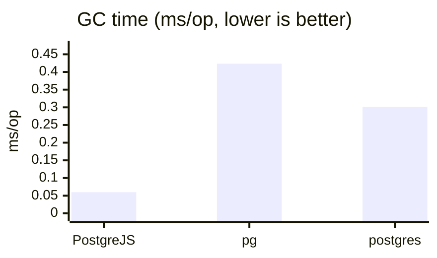

</td><td style="border:none;margin:0;padding:4px;">

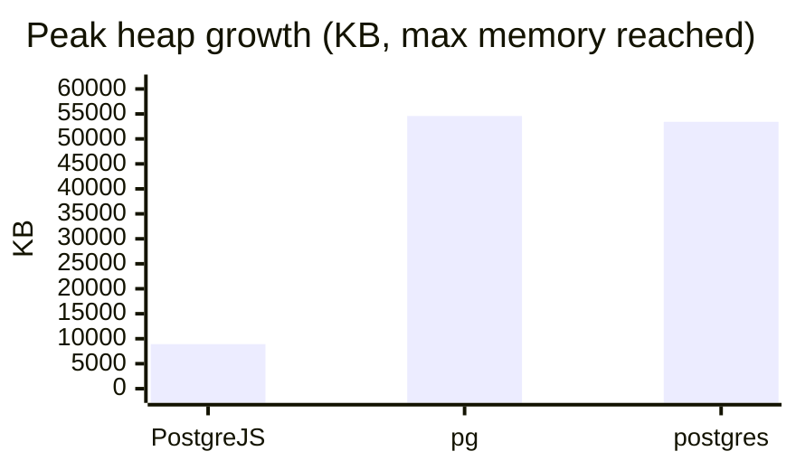

</td></tr>
</table>

## Extended Query

PostgreSQL's Extended Query sub-protocol: the client splits a query into separate `Parse`, `Bind`, `Describe`, `Execute`, and `Sync` messages instead of Simple Query's single `Query` message - more wire round trips per query, but it is what makes bind parameters, typed result columns, and a statement the server plans once and can re-execute possible at all (none of that exists in Simple Query). In postgrejs, `Connection.query(sql)` always goes through this path, and `Connection.prepare(sql)` additionally gives back a reusable `PreparedStatement` handle instead of re-sending `Parse` on every call. The scenarios here mirror the Simple Query group's own Sequential/Concurrent pair - a single parameterized call one at a time, then many fired concurrently over one connection - plus decoding many mixed-type rows through `query()` (the row count itself a bind parameter, large enough that decode work dominates the measurement) on both the text and binary wire formats, and the cost this protocol is meant to amortize away: reusing one prepared statement across many executions, sequentially and then concurrently.

### Sequential Execution

The Extended Query counterpart to the Simple Query group's
Sequential Execution above: one already-open connection, one call at a
time, each awaited before the next starts.

Instead of a literal, it selects an int2 value bound as a real query
parameter (`select $1::int2`), so every library genuinely goes through
Parse/Bind/Describe/Execute/Sync rather than a single Query message.

Unlike Prepared Statement Reuse below, there is no reused or cached
server-side statement here, so this isolates the one-shot per-call cost
Extended Query pays on top of the Simple Query baseline. Compare it
against Concurrent Execution below to see what overlapping calls buys
each library here too.

| Library | Mean (ms) | p75 (ms) | p99 (ms) | ops/sec | vs. slowest | GC (ms/op) | Peak Heap (KB) |
|---|---:|---:|---:|---:|---:|---:|---:|
| pg (node-postgres) (8.23.0) | ***0.260*** | ***0.276*** | ***0.619*** | ***4215.9*** | ***1.79x*** | 0.0019 | 10783.08 |
| PostgreJS (3.0.0) | 0.265 | 0.287 | 0.622 | 4120.8 | 1.76x | ***0.0013*** | ***5771.33*** |
| postgres (postgres.js) (3.4.9) | 0.466 | 0.522 | 0.961 | 2298.8 | 1.00x | 0.0026 | 8903.77 |

<table border="0" style="border:none;border-collapse:collapse;border-spacing:2px;">
<tr style="border:none;"><td style="border:none;margin:0;padding:4px;">

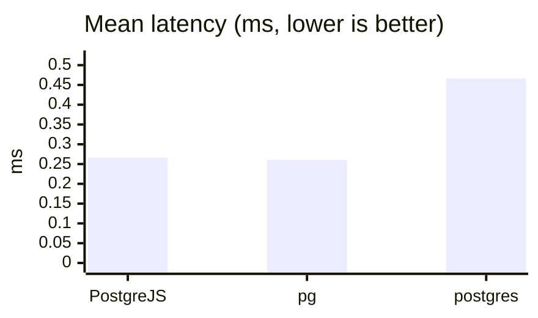

</td><td style="border:none;margin:0;padding:4px;">

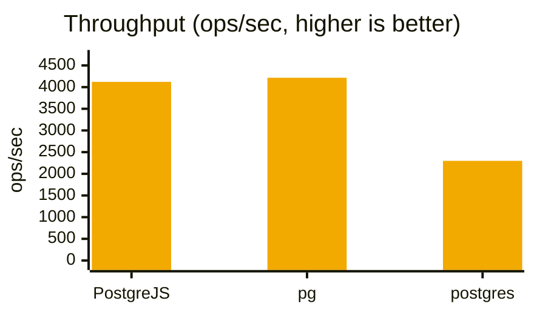

</td></tr>
<tr style="border:none;"><td style="border:none;margin:0;padding:4px;">

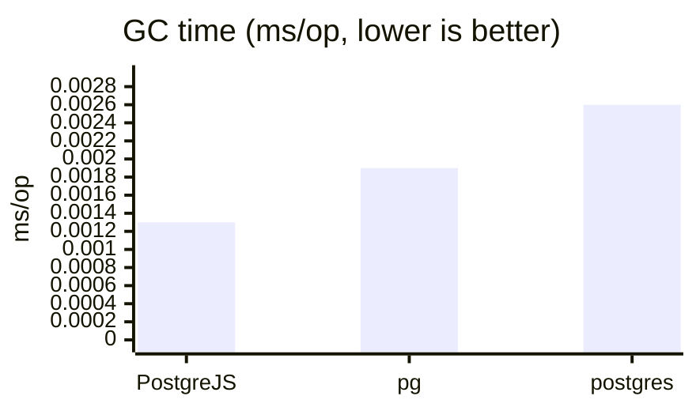

</td><td style="border:none;margin:0;padding:4px;">

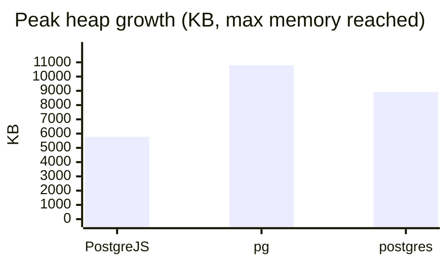

</td></tr>
</table>

### Concurrent Execution

The concurrent counterpart to Sequential Execution above, same
shape as the Simple Query group's Concurrent Execution.

Fire 50 genuine Extended Query
calls (`select $1::int2`, a real bind parameter, not a reused/cached
statement) on the SAME already-open connection without awaiting each one
individually, then await them all via Promise.all(). PostgreJS pipelines
these at the wire level, so results never cross-talk even though the
caller never awaited between calls.

Each call binds a distinct value and checks the result against it, so this
scenario verifies correctness too - do the other libraries' single
connections queue/pipeline Extended Query calls correctly? - not just
timing. (concurrency=50)

| Library | Mean (ms) | p75 (ms) | p99 (ms) | ops/sec | vs. slowest | GC (ms/op) | Peak Heap (KB) |
|---|---:|---:|---:|---:|---:|---:|---:|
| pg (node-postgres) (8.23.0) | ***2.744*** | ***2.857*** | ***4.522*** | ***371.2*** | ***8.14x*** | 0.0318 | 20085.61 |
| PostgreJS (3.0.0) | 3.045 | 3.126 | 5.401 | 337.5 | 7.34x | ***0.0287*** | ***9602.65*** |
| postgres (postgres.js) (3.4.9) | 22.346 | 23.369 | 26.558 | 45.0 | 1.00x | 0.1365 | 14247.38 |

<table border="0" style="border:none;border-collapse:collapse;border-spacing:2px;">
<tr style="border:none;"><td style="border:none;margin:0;padding:4px;">

```mermaid
%%{init: {'xyChart': {'width': 440, 'height': 260}}}%%
xychart-beta
    title "Mean latency (ms, lower is better)"
    x-axis ["PostgreJS", "pg", "postgres"]
    y-axis "ms" 0.0000 --> 24.5810
    bar [3.0446, 2.7441, 22.3463]
```

</td><td style="border:none;margin:0;padding:4px;">

```mermaid
%%{init: {'xyChart': {'width': 440, 'height': 260}, 'themeVariables': {'xyChart': {'plotColorPalette': '#f2a900'}}}}%%
xychart-beta
    title "Throughput (ops/sec, higher is better)"
    x-axis ["PostgreJS", "pg", "postgres"]
    y-axis "ops/sec" 0.0000 --> 408.3589
    bar [337.5471, 371.2354, 44.9820]
```

</td></tr>
<tr style="border:none;"><td style="border:none;margin:0;padding:4px;">

```mermaid
%%{init: {'xyChart': {'width': 440, 'height': 260}}}%%
xychart-beta
    title "GC time (ms/op, lower is better)"
    x-axis ["PostgreJS", "pg", "postgres"]
    y-axis "ms/op" 0.0000 --> 0.1501
    bar [0.0287, 0.0318, 0.1365]
```

</td><td style="border:none;margin:0;padding:4px;">

```mermaid
%%{init: {'xyChart': {'width': 440, 'height': 260}}}%%
xychart-beta
    title "Peak heap growth (KB, max memory reached)"
    x-axis ["PostgreJS", "pg", "postgres"]
    y-axis "KB" 0.0000 --> 22094.1703
    bar [9602.6484, 20085.6094, 14247.3750]
```

</td></tr>
</table>

### Mixed-Type Decode (Text Protocol)

Fetch 1000 mixed-type rows (int2/int4/
float4/float8/varchar/json/jsonb/timestamp/timestamptz/bytea) via each
library's Extended Query path - PostgreJS's query(), a one-shot
parameterized call, not a reused prepared statement - and decode them to
JS values. The row count is itself a real bind parameter ($1), not a
literal, and large enough that column-decode work dominates the
measurement rather than per-call round-trip overhead.

This is the Extended Query counterpart to Simple Query Fetch above: the
raw decode cost this protocol carries per call, before Prepared Statement
Reuse below measures what reusing the parsed plan saves.

Excludes int8: pg, postgres.js and PostgreJS return it as genuinely
different JS types by default (string, BigInt, number-or-BigInt). Timing
that column would measure type-conversion choice, not decode speed.

Forces PostgreJS onto the text protocol explicitly. Its Extended Query
default is binary, per-column, unlike pg and postgres.js, which are always
text here - pg's binary mode is opt-in and never requested, and
postgres.js has no binary protocol support at all. Without that, this
scenario would compare binary decode against text decode, not decode
speed. (rowTarget=1000)

| Library | Mean (ms) | p75 (ms) | p99 (ms) | ops/sec | vs. slowest | GC (ms/op) | Peak Heap (KB) |
|---|---:|---:|---:|---:|---:|---:|---:|
| PostgreJS (3.0.0) | ***3.339*** | ***3.498*** | ***4.570*** | ***302.4*** | ***1.25x*** | ***0.0704*** | ***8949.91*** |
| postgres (postgres.js) (3.4.9) | 3.734 | 3.713 | 9.185 | 288.7 | 1.12x | 0.2912 | 53139.22 |
| pg (node-postgres) (8.23.0) | 4.186 | 4.147 | 9.492 | 252.8 | 1.00x | 0.3824 | 56337.49 |

<table border="0" style="border:none;border-collapse:collapse;border-spacing:2px;">
<tr style="border:none;"><td style="border:none;margin:0;padding:4px;">

```mermaid
%%{init: {'xyChart': {'width': 440, 'height': 260}}}%%
xychart-beta
    title "Mean latency (ms, lower is better)"
    x-axis ["PostgreJS", "pg", "postgres"]
    y-axis "ms" 0.0000 --> 4.6047
    bar [3.3388, 4.1861, 3.7344]
```

</td><td style="border:none;margin:0;padding:4px;">

```mermaid
%%{init: {'xyChart': {'width': 440, 'height': 260}, 'themeVariables': {'xyChart': {'plotColorPalette': '#f2a900'}}}}%%
xychart-beta
    title "Throughput (ops/sec, higher is better)"
    x-axis ["PostgreJS", "pg", "postgres"]
    y-axis "ops/sec" 0.0000 --> 332.6204
    bar [302.3822, 252.7800, 288.7408]
```

</td></tr>
<tr style="border:none;"><td style="border:none;margin:0;padding:4px;">

```mermaid
%%{init: {'xyChart': {'width': 440, 'height': 260}}}%%
xychart-beta
    title "GC time (ms/op, lower is better)"
    x-axis ["PostgreJS", "pg", "postgres"]
    y-axis "ms/op" 0.0000 --> 0.4207
    bar [0.0704, 0.3824, 0.2912]
```

</td><td style="border:none;margin:0;padding:4px;">

```mermaid
%%{init: {'xyChart': {'width': 440, 'height': 260}}}%%
xychart-beta
    title "Peak heap growth (KB, max memory reached)"
    x-axis ["PostgreJS", "pg", "postgres"]
    y-axis "KB" 0.0000 --> 61971.2414
    bar [8949.9141, 56337.4922, 53139.2188]
```

</td></tr>
</table>

### Mixed-Type Decode (Binary Protocol)

The same fetch as Mixed-Type Decode (Text Protocol) above - same
1000 rows, same columns, same bind-parameter
row count - but requesting binary result format instead of text. That is
PostgreJS's own Extended Query default (`DEFAULT_COLUMN_FORMAT`), so this
measures its binary decode path on its own terms rather than forcing it
onto text.

postgres.js has no binary protocol support at all: its `Bind` message
hardcodes text format codes for every column, with no option to request
binary (verified in its own source). It isn't benchmarked here.

pg's binary parser table (`pg-types`) is missing exactly the column types
this scenario decodes - `varchar`/`json`/`jsonb`/`bytea` are unregistered
for binary, only a handful of numeric/date/bool types are. Requesting
binary from pg would return those columns unparsed or corrupted rather
than a comparable value, so it's excluded rather than reported as a
misleading number.

Only PostgreJS's own result is shown. (rowTarget=1000)

| Library | Mean (ms) | p75 (ms) | p99 (ms) | ops/sec | vs. slowest | GC (ms/op) | Peak Heap (KB) |
|---|---:|---:|---:|---:|---:|---:|---:|
| PostgreJS (3.0.0) | 2.984 | 3.088 | 3.812 | 339.6 | 1.00x | 0.0829 | 10370.98 |
| pg (node-postgres) | Not Fully Supported | — | — | — | — | — | — |
| postgres (postgres.js) | Not Supported | — | — | — | — | — | — |

<table border="0" style="border:none;border-collapse:collapse;border-spacing:2px;">
<tr style="border:none;"><td style="border:none;margin:0;padding:4px;">

```mermaid
%%{init: {'xyChart': {'width': 440, 'height': 260}}}%%
xychart-beta
    title "Mean latency (ms, lower is better)"
    x-axis ["PostgreJS"]
    y-axis "ms" 0.0000 --> 3.2828
    bar [2.9844]
```

</td><td style="border:none;margin:0;padding:4px;">

```mermaid
%%{init: {'xyChart': {'width': 440, 'height': 260}, 'themeVariables': {'xyChart': {'plotColorPalette': '#f2a900'}}}}%%
xychart-beta
    title "Throughput (ops/sec, higher is better)"
    x-axis ["PostgreJS"]
    y-axis "ops/sec" 0.0000 --> 373.5780
    bar [339.6164]
```

</td></tr>
<tr style="border:none;"><td style="border:none;margin:0;padding:4px;">

```mermaid
%%{init: {'xyChart': {'width': 440, 'height': 260}}}%%
xychart-beta
    title "GC time (ms/op, lower is better)"
    x-axis ["PostgreJS"]
    y-axis "ms/op" 0.0000 --> 0.0911
    bar [0.0829]
```

</td><td style="border:none;margin:0;padding:4px;">

```mermaid
%%{init: {'xyChart': {'width': 440, 'height': 260}}}%%
xychart-beta
    title "Peak heap growth (KB, max memory reached)"
    x-axis ["PostgreJS"]
    y-axis "KB" 0.0000 --> 11408.0828
    bar [10370.9844]
```

</td></tr>
</table>

### Large Blob Fetch

Fetch 10 rows of a
1MB bytea value each
(10MB total)
via each library's Extended Query path, with the row count itself a real
bind parameter, not a literal. The measurement is dominated by
wire-transfer and decode time for a few large values, instead of
per-row/per-column overhead across many small ones - the counterpart to
Mixed-Type Decode above, which is many small values.

Unlike that scenario, no protocol format is forced onto anyone here:
PostgreJS is left on its own Extended Query default (binary), and
pg/postgres.js get whatever their own default is.

postgres.js has no binary protocol support at all (verified elsewhere in
this report), so it always fetches as text - hex-encoded on the wire,
decoded client-side. pg's binary parser table (`pg-types`) has no entry
for `bytea` either (verified live: requesting binary format for a bytea
column returns a corrupted value, not a Buffer) - undocumented and unsafe
to rely on, so pg is left on its own text default too, same as
postgres.js.

Only PostgreJS ends up genuinely exercising a binary fetch; the other two
show their real, best-available path rather than a forced or broken one -
and pay for it. bytea's text format is `\x`-prefixed hex, literally 2x the
wire bytes of binary's raw bytes, so pg and postgres.js transfer twice
what PostgreJS does here. (sizeBytes=1048576, rowCount=10)

| Library | Mean (ms) | p75 (ms) | p99 (ms) | ops/sec | vs. slowest | GC (ms/op) | Peak Heap (KB) | Network (KB/op) |
|---|---:|---:|---:|---:|---:|---:|---:|---:|
| PostgreJS (3.0.0) | ***61.581*** | ***62.595*** | ***69.579*** | ***16.3*** | ***2.09x*** | 1.4054 | ***1068.42*** | ***12800.20*** |
| pg (node-postgres) (8.23.0) | 122.442 | 122.270 | 135.915 | 8.3 | 1.05x | ***1.0887*** | 2040.03 | 25600.23 |
| postgres (postgres.js) (3.4.9) | 128.883 | 126.907 | 208.159 | 8.0 | 1.00x | 1.2072 | 1989.27 | 25600.25 |

<table border="0" style="border:none;border-collapse:collapse;border-spacing:2px;">
<tr style="border:none;"><td style="border:none;margin:0;padding:4px;">

```mermaid
%%{init: {'xyChart': {'width': 440, 'height': 260}}}%%
xychart-beta
    title "Mean latency (ms, lower is better)"
    x-axis ["PostgreJS", "pg", "postgres"]
    y-axis "ms" 0.0000 --> 141.7711
    bar [61.5815, 122.4422, 128.8828]
```

</td><td style="border:none;margin:0;padding:4px;">

```mermaid
%%{init: {'xyChart': {'width': 440, 'height': 260}, 'themeVariables': {'xyChart': {'plotColorPalette': '#f2a900'}}}}%%
xychart-beta
    title "Throughput (ops/sec, higher is better)"
    x-axis ["PostgreJS", "pg", "postgres"]
    y-axis "ops/sec" 0.0000 --> 17.9156
    bar [16.2869, 8.2652, 7.9815]
```

</td></tr>
<tr style="border:none;"><td style="border:none;margin:0;padding:4px;">

```mermaid
%%{init: {'xyChart': {'width': 440, 'height': 260}}}%%
xychart-beta
    title "GC time (ms/op, lower is better)"
    x-axis ["PostgreJS", "pg", "postgres"]
    y-axis "ms/op" 0.0000 --> 1.5459
    bar [1.4054, 1.0887, 1.2072]
```

</td><td style="border:none;margin:0;padding:4px;">

```mermaid
%%{init: {'xyChart': {'width': 440, 'height': 260}}}%%
xychart-beta
    title "Peak heap growth (KB, max memory reached)"
    x-axis ["PostgreJS", "pg", "postgres"]
    y-axis "KB" 0.0000 --> 2244.0344
    bar [1068.4219, 2040.0313, 1989.2656]
```

</td></tr>
<tr style="border:none;"><td style="border:none;margin:0;padding:4px;">

```mermaid
%%{init: {'xyChart': {'width': 440, 'height': 260}}}%%
xychart-beta
    title "Network received (KB/op, lower is better)"
    x-axis ["PostgreJS", "pg", "postgres"]
    y-axis "KB/op" 0.0000 --> 28160.2712
    bar [12800.1965, 25600.2332, 25600.2466]
```

</td></tr>
</table>

### Large Array Fetch

Fetch 10 rows of an int4[] with
50000 elements each, via each library's Extended
Query path, with the row count itself a real bind parameter, not a
literal. Elements alternate between just below int4's ceiling and just
above its floor, so every value is full-width and roughly half are
negative. Full-width values are what show binary format's real wire
advantage: binary spends a fixed 8 bytes per int4 element, while text
spends one byte per digit.

This is the array counterpart to Large Blob Fetch above (one large scalar
value) and Mixed-Type Decode (many small values): here it is many elements
within a single column value, repeated across rows. Element count, not
byte size, is what drives cost for an array, unlike a blob - see this
file's own comments for the measurement that showed why - so this is
sized for a clear decode-time gap without ballooning each iteration to
whole seconds.

As with Large Blob Fetch, no protocol format is forced onto anyone:
PostgreJS is left on its own Extended Query default (binary).

pg's binary array decode (`pg-types`) is registered-but-buggy rather than
simply unsupported. It does have a registered binary parser for `_int4`
(unlike `bytea`), but that parser reads every element as an unsigned bit
pattern, with no two's-complement handling for negative values. Verified
live: requesting binary format for an int4[] containing negative numbers
returns wrong values from the first negative element onward, and desyncs
the element count entirely on a larger array - a 1500-element array came
back as 1519 elements, values wrong.

So pg is left on its own text default here too, same as postgres.js (no
binary protocol support at all, verified elsewhere in this report). A case
where a library merely having a registered binary parser is not the same
as that parser being safe to use. (elementCount=50000, rowCount=10)

| Library | Mean (ms) | p75 (ms) | p99 (ms) | ops/sec | vs. slowest | GC (ms/op) | Peak Heap (KB) | Network (KB/op) |
|---|---:|---:|---:|---:|---:|---:|---:|---:|
| PostgreJS (3.0.0) | ***30.481*** | ***31.749*** | ***34.516*** | ***32.9*** | ***5.61x*** | ***1.0560*** | ***9237.55*** | ***4735.28*** |
| postgres (postgres.js) (3.4.9) | 67.604 | 68.273 | 75.965 | 14.8 | 2.53x | 2.2036 | 101312.77 | 7019.28 |
| pg (node-postgres) (8.23.0) | 171.039 | 170.544 | 194.658 | 5.9 | 1.00x | 4.5153 | 103857.42 | 7019.26 |

<table border="0" style="border:none;border-collapse:collapse;border-spacing:2px;">
<tr style="border:none;"><td style="border:none;margin:0;padding:4px;">

```mermaid
%%{init: {'xyChart': {'width': 440, 'height': 260}}}%%
xychart-beta
    title "Mean latency (ms, lower is better)"
    x-axis ["PostgreJS", "pg", "postgres"]
    y-axis "ms" 0.0000 --> 188.1434
    bar [30.4812, 171.0395, 67.6036]
```

</td><td style="border:none;margin:0;padding:4px;">

```mermaid
%%{init: {'xyChart': {'width': 440, 'height': 260}, 'themeVariables': {'xyChart': {'plotColorPalette': '#f2a900'}}}}%%
xychart-beta
    title "Throughput (ops/sec, higher is better)"
    x-axis ["PostgreJS", "pg", "postgres"]
    y-axis "ops/sec" 0.0000 --> 36.2287
    bar [32.9352, 5.9000, 14.8270]
```

</td></tr>
<tr style="border:none;"><td style="border:none;margin:0;padding:4px;">

```mermaid
%%{init: {'xyChart': {'width': 440, 'height': 260}}}%%
xychart-beta
    title "GC time (ms/op, lower is better)"
    x-axis ["PostgreJS", "pg", "postgres"]
    y-axis "ms/op" 0.0000 --> 4.9669
    bar [1.0560, 4.5153, 2.2036]
```

</td><td style="border:none;margin:0;padding:4px;">

```mermaid
%%{init: {'xyChart': {'width': 440, 'height': 260}}}%%
xychart-beta
    title "Peak heap growth (KB, max memory reached)"
    x-axis ["PostgreJS", "pg", "postgres"]
    y-axis "KB" 0.0000 --> 114243.1641
    bar [9237.5547, 103857.4219, 101312.7734]
```

</td></tr>
<tr style="border:none;"><td style="border:none;margin:0;padding:4px;">

```mermaid
%%{init: {'xyChart': {'width': 440, 'height': 260}}}%%
xychart-beta
    title "Network received (KB/op, lower is better)"
    x-axis ["PostgreJS", "pg", "postgres"]
    y-axis "KB/op" 0.0000 --> 7721.2051
    bar [4735.2758, 7019.2639, 7019.2773]
```

</td></tr>
</table>

### Prepared Statement Reuse (Sequential)

Prepare once and execute 50 times,
one at a time, each awaited before the next starts. Each library uses its
own prepared-statement mechanism: postgres.js auto-prepares, pg uses a
named statement, PostgreJS uses explicit prepare()/execute()/close().

Compare it against the Concurrent variant below to see what overlapping
executions of the same reused statement buys each library.

Excludes int8: pg, postgres.js and PostgreJS return it as genuinely
different JS types by default (string, BigInt, number-or-BigInt), so
timing it would measure type-conversion choice, not reuse cost. (iterations=50)

| Library | Mean (ms) | p75 (ms) | p99 (ms) | ops/sec | vs. slowest | GC (ms/op) | Peak Heap (KB) |
|---|---:|---:|---:|---:|---:|---:|---:|
| PostgreJS (3.0.0) | ***11.965*** | ***12.637*** | ***14.932*** | ***84.4*** | ***1.11x*** | ***0.0349*** | ***4607.51*** |
| postgres (postgres.js) (3.4.9) | 12.481 | 12.732 | 17.360 | 83.8 | 1.07x | 0.0741 | 14155.59 |
| pg (node-postgres) (8.23.0) | 13.327 | 13.680 | 23.536 | 78.0 | 1.00x | 0.1222 | 17819.41 |

<table border="0" style="border:none;border-collapse:collapse;border-spacing:2px;">
<tr style="border:none;"><td style="border:none;margin:0;padding:4px;">

```mermaid
%%{init: {'xyChart': {'width': 440, 'height': 260}}}%%
xychart-beta
    title "Mean latency (ms, lower is better)"
    x-axis ["PostgreJS", "pg", "postgres"]
    y-axis "ms" 0.0000 --> 14.6601
    bar [11.9646, 13.3274, 12.4808]
```

</td><td style="border:none;margin:0;padding:4px;">

```mermaid
%%{init: {'xyChart': {'width': 440, 'height': 260}, 'themeVariables': {'xyChart': {'plotColorPalette': '#f2a900'}}}}%%
xychart-beta
    title "Throughput (ops/sec, higher is better)"
    x-axis ["PostgreJS", "pg", "postgres"]
    y-axis "ops/sec" 0.0000 --> 92.8701
    bar [84.4273, 78.0318, 83.8293]
```

</td></tr>
<tr style="border:none;"><td style="border:none;margin:0;padding:4px;">

```mermaid
%%{init: {'xyChart': {'width': 440, 'height': 260}}}%%
xychart-beta
    title "GC time (ms/op, lower is better)"
    x-axis ["PostgreJS", "pg", "postgres"]
    y-axis "ms/op" 0.0000 --> 0.1344
    bar [0.0349, 0.1222, 0.0741]
```

</td><td style="border:none;margin:0;padding:4px;">

```mermaid
%%{init: {'xyChart': {'width': 440, 'height': 260}}}%%
xychart-beta
    title "Peak heap growth (KB, max memory reached)"
    x-axis ["PostgreJS", "pg", "postgres"]
    y-axis "KB" 0.0000 --> 19601.3555
    bar [4607.5078, 17819.4141, 14155.5938]
```

</td></tr>
</table>

### Prepared Statement Reuse (Concurrent)

The concurrent counterpart to Sequential above: prepare once,
then fire 50 executions of
that same reused statement on the SAME already-open connection without
awaiting each one individually, then await them all via Promise.all().

Each library uses its own prepared-statement mechanism: postgres.js
auto-prepares, pg uses a named statement, PostgreJS uses explicit
prepare()/execute()/close().

Excludes int8: pg, postgres.js and PostgreJS return it as genuinely
different JS types by default (string, BigInt, number-or-BigInt), so
timing it would measure type-conversion choice, not reuse cost. (concurrency=50)

| Library | Mean (ms) | p75 (ms) | p99 (ms) | ops/sec | vs. slowest | GC (ms/op) | Peak Heap (KB) |
|---|---:|---:|---:|---:|---:|---:|---:|
| postgres (postgres.js) (3.4.9) | ***2.233*** | ***2.335*** | ***3.806*** | ***457.9*** | ***1.08x*** | 0.0429 | 52060.52 |
| PostgreJS (3.0.0) | 2.402 | 2.784 | 4.123 | 436.6 | 1.00x | ***0.0192*** | ***8474.34*** |
| pg (node-postgres) (8.23.0) | 2.405 | 2.495 | 4.189 | 431.5 | 1.00x | 0.0314 | 35192.66 |

<table border="0" style="border:none;border-collapse:collapse;border-spacing:2px;">
<tr style="border:none;"><td style="border:none;margin:0;padding:4px;">

```mermaid
%%{init: {'xyChart': {'width': 440, 'height': 260}}}%%
xychart-beta
    title "Mean latency (ms, lower is better)"
    x-axis ["PostgreJS", "pg", "postgres"]
    y-axis "ms" 0.0000 --> 2.6460
    bar [2.4019, 2.4055, 2.2332]
```

</td><td style="border:none;margin:0;padding:4px;">

```mermaid
%%{init: {'xyChart': {'width': 440, 'height': 260}, 'themeVariables': {'xyChart': {'plotColorPalette': '#f2a900'}}}}%%
xychart-beta
    title "Throughput (ops/sec, higher is better)"
    x-axis ["PostgreJS", "pg", "postgres"]
    y-axis "ops/sec" 0.0000 --> 503.7410
    bar [436.6172, 431.5108, 457.9463]
```

</td></tr>
<tr style="border:none;"><td style="border:none;margin:0;padding:4px;">

```mermaid
%%{init: {'xyChart': {'width': 440, 'height': 260}}}%%
xychart-beta
    title "GC time (ms/op, lower is better)"
    x-axis ["PostgreJS", "pg", "postgres"]
    y-axis "ms/op" 0.0000 --> 0.0472
    bar [0.0192, 0.0314, 0.0429]
```

</td><td style="border:none;margin:0;padding:4px;">

```mermaid
%%{init: {'xyChart': {'width': 440, 'height': 260}}}%%
xychart-beta
    title "Peak heap growth (KB, max memory reached)"
    x-axis ["PostgreJS", "pg", "postgres"]
    y-axis "KB" 0.0000 --> 57266.5672
    bar [8474.3359, 35192.6641, 52060.5156]
```

</td></tr>
</table>

## Cursor Streaming

A server-side cursor (postgrejs's `Connection.query(sql, { cursor: true })`) fetches rows in bounded batches via repeated Extended Query `Execute` calls against a portal, instead of the server materializing and sending the whole result set at once. The relevant metric when a result set doesn't comfortably fit in memory, not raw single-shot throughput.

### Cursor Streaming

Stream 50000 rows via a server-side cursor in batches of 500. 
Excludes int8: pg/postgres.js/PostgreJS return it as genuinely different JS types by default (string/BigInt/number-or-BigInt), 
so timing it would measure type-conversion choice, not streaming throughput (rowTarget=50000, batchSize=500)

| Library | Mean (ms) | p75 (ms) | p99 (ms) | ops/sec | vs. slowest | GC (ms/op) | Peak Heap (KB) |
|---|---:|---:|---:|---:|---:|---:|---:|
| PostgreJS (3.0.0) | ***181.488*** | ***188.450*** | ***188.725*** | ***5.5*** | ***1.55x*** | ***3.9311*** | ***10263.38*** |
| pg (node-postgres) (8.23.0) | 229.045 | 229.849 | 254.848 | 4.4 | 1.23x | 13.3312 | 64634.39 |
| postgres (postgres.js) (3.4.9) | 280.623 | 286.738 | 305.955 | 3.6 | 1.00x | 14.8858 | 54763.71 |

<table border="0" style="border:none;border-collapse:collapse;border-spacing:2px;">
<tr style="border:none;"><td style="border:none;margin:0;padding:4px;">

```mermaid
%%{init: {'xyChart': {'width': 440, 'height': 260}}}%%
xychart-beta
    title "Mean latency (ms, lower is better)"
    x-axis ["PostgreJS", "pg", "postgres"]
    y-axis "ms" 0.0000 --> 308.6855
    bar [181.4884, 229.0453, 280.6231]
```

</td><td style="border:none;margin:0;padding:4px;">

```mermaid
%%{init: {'xyChart': {'width': 440, 'height': 260}, 'themeVariables': {'xyChart': {'plotColorPalette': '#f2a900'}}}}%%
xychart-beta
    title "Throughput (ops/sec, higher is better)"
    x-axis ["PostgreJS", "pg", "postgres"]
    y-axis "ops/sec" 0.0000 --> 6.0676
    bar [5.5160, 4.3837, 3.6286]
```

</td></tr>
<tr style="border:none;"><td style="border:none;margin:0;padding:4px;">

```mermaid
%%{init: {'xyChart': {'width': 440, 'height': 260}}}%%
xychart-beta
    title "GC time (ms/op, lower is better)"
    x-axis ["PostgreJS", "pg", "postgres"]
    y-axis "ms/op" 0.0000 --> 16.3744
    bar [3.9311, 13.3312, 14.8858]
```

</td><td style="border:none;margin:0;padding:4px;">

```mermaid
%%{init: {'xyChart': {'width': 440, 'height': 260}}}%%
xychart-beta
    title "Peak heap growth (KB, max memory reached)"
    x-axis ["PostgreJS", "pg", "postgres"]
    y-axis "KB" 0.0000 --> 71097.8297
    bar [10263.3750, 64634.3906, 54763.7109]
```

</td></tr>
</table>

## Connection Pooling

The overhead each library's connection pool adds on top of the raw per-query costs measured above: running many queries concurrently through a shared pool (postgrejs's `Pool.query()`), and isolating the pure cost of acquiring and releasing a pooled connection from the cost of the query itself.

### Pooled Simple Query

Same query as Sequential Execution/Concurrent Execution above,
run through a pool instead of a single open connection:
1000 concurrent `select 1 as one`
queries against a pool of max size 10,
using each library's own top-level pooled entry point. (concurrency=1000, poolSize=10)

| Library | Mean (ms) | p75 (ms) | p99 (ms) | ops/sec | vs. slowest | GC (ms/op) | Peak Heap (KB) |
|---|---:|---:|---:|---:|---:|---:|---:|
| PostgreJS (3.0.0) | ***23.644*** | ***24.961*** | ***43.205*** | 43.4 | ***3.20x*** | 2.5136 | 61965.56 |
| postgres (postgres.js) (3.4.9) | 35.977 | 31.441 | 141.728 | ***43.5*** | 2.10x | 2.6808 | 41313.73 |
| pg (node-postgres) (8.23.0) | 75.561 | 76.082 | 98.012 | 13.4 | 1.00x | ***1.2929*** | ***15485.18*** |

<table border="0" style="border:none;border-collapse:collapse;border-spacing:2px;">
<tr style="border:none;"><td style="border:none;margin:0;padding:4px;">

```mermaid
%%{init: {'xyChart': {'width': 440, 'height': 260}}}%%
xychart-beta
    title "Mean latency (ms, lower is better)"
    x-axis ["PostgreJS", "pg", "postgres"]
    y-axis "ms" 0.0000 --> 83.1173
    bar [23.6435, 75.5612, 35.9769]
```

</td><td style="border:none;margin:0;padding:4px;">

```mermaid
%%{init: {'xyChart': {'width': 440, 'height': 260}, 'themeVariables': {'xyChart': {'plotColorPalette': '#f2a900'}}}}%%
xychart-beta
    title "Throughput (ops/sec, higher is better)"
    x-axis ["PostgreJS", "pg", "postgres"]
    y-axis "ops/sec" 0.0000 --> 47.8548
    bar [43.4265, 13.3631, 43.5044]
```

</td></tr>
<tr style="border:none;"><td style="border:none;margin:0;padding:4px;">

```mermaid
%%{init: {'xyChart': {'width': 440, 'height': 260}}}%%
xychart-beta
    title "GC time (ms/op, lower is better)"
    x-axis ["PostgreJS", "pg", "postgres"]
    y-axis "ms/op" 0.0000 --> 2.9489
    bar [2.5136, 1.2929, 2.6808]
```

</td><td style="border:none;margin:0;padding:4px;">

```mermaid
%%{init: {'xyChart': {'width': 440, 'height': 260}}}%%
xychart-beta
    title "Peak heap growth (KB, max memory reached)"
    x-axis ["PostgreJS", "pg", "postgres"]
    y-axis "KB" 0.0000 --> 68162.1188
    bar [61965.5625, 15485.1797, 41313.7344]
```

</td></tr>
</table>

### Pooled Extended Query

The Extended Query counterpart to Pooled Simple Query above: the
same 1000 concurrent calls against a
pool of max size 10, but binding a
real query parameter (`select $1::int2 as one`) so every library goes
through Parse/Bind/Describe/Execute/Sync instead of a single Query
message.

Each call is a one-shot statement, not a reused prepared one, so this
shows what a pool costs on top of the per-call Extended Query overhead.
Compare it against this group's Pooled Simple Query to see what the extra
protocol round of messages adds once connections are being shared.

Read the margin here with that one-shot constraint in mind. postgres.js's
unprepared path (`sql.unsafe(query, args)`, the same call the
single-connection Sequential Execution scenario uses, where it comes out
ahead) does not pipeline a burst the way its prepared path does. Letting
it cache the statement instead turns this into a different measurement
entirely, which is what Prepared Statement Reuse below covers. (concurrency=1000, poolSize=10)

| Library | Mean (ms) | p75 (ms) | p99 (ms) | ops/sec | vs. slowest | GC (ms/op) | Peak Heap (KB) |
|---|---:|---:|---:|---:|---:|---:|---:|
| PostgreJS (3.0.0) | ***23.129*** | ***23.981*** | ***33.404*** | ***44.2*** | ***5.92x*** | 2.1885 | 58873.32 |
| pg (node-postgres) (8.23.0) | 79.293 | 84.301 | 111.574 | 12.8 | 1.73x | ***1.3654*** | ***16043.04*** |
| postgres (postgres.js) (3.4.9) | 137.003 | 144.666 | 174.409 | 7.3 | 1.00x | 2.4527 | 17937.95 |

<table border="0" style="border:none;border-collapse:collapse;border-spacing:2px;">
<tr style="border:none;"><td style="border:none;margin:0;padding:4px;">

```mermaid
%%{init: {'xyChart': {'width': 440, 'height': 260}}}%%
xychart-beta
    title "Mean latency (ms, lower is better)"
    x-axis ["PostgreJS", "pg", "postgres"]
    y-axis "ms" 0.0000 --> 150.7034
    bar [23.1287, 79.2926, 137.0031]
```

</td><td style="border:none;margin:0;padding:4px;">

```mermaid
%%{init: {'xyChart': {'width': 440, 'height': 260}, 'themeVariables': {'xyChart': {'plotColorPalette': '#f2a900'}}}}%%
xychart-beta
    title "Throughput (ops/sec, higher is better)"
    x-axis ["PostgreJS", "pg", "postgres"]
    y-axis "ops/sec" 0.0000 --> 48.6362
    bar [44.2147, 12.7614, 7.3229]
```

</td></tr>
<tr style="border:none;"><td style="border:none;margin:0;padding:4px;">

```mermaid
%%{init: {'xyChart': {'width': 440, 'height': 260}}}%%
xychart-beta
    title "GC time (ms/op, lower is better)"
    x-axis ["PostgreJS", "pg", "postgres"]
    y-axis "ms/op" 0.0000 --> 2.6980
    bar [2.1885, 1.3654, 2.4527]
```

</td><td style="border:none;margin:0;padding:4px;">

```mermaid
%%{init: {'xyChart': {'width': 440, 'height': 260}}}%%
xychart-beta
    title "Peak heap growth (KB, max memory reached)"
    x-axis ["PostgreJS", "pg", "postgres"]
    y-axis "KB" 0.0000 --> 64760.6523
    bar [58873.3203, 16043.0391, 17937.9453]
```

</td></tr>
</table>

## Raw data

Backing raw data for the numbers above lives in `benchmark/results/*.json` (gitignored; regenerate with `npm run bench`).
