# PostgreJS Benchmarks (Bun)

_Generated by `npm run bench:report`. Do not hand-edit — re-run the command instead._

## Contents

- [Methodology](#methodology)
  - [Disclosed asymmetries](#disclosed-asymmetries)
- [Environment](#environment)
- [Connection](#connection)
  - [Connect](#connect)
- [Simple Query](#simple-query)
  - [Sequential Execution](#sequential-execution)
  - [Concurrent Execution](#concurrent-execution)
  - [Simple Query Fetch](#simple-query-fetch)
- [Extended Query](#extended-query)
  - [Sequential Execution](#sequential-execution-1)
  - [Concurrent Execution](#concurrent-execution-1)
  - [Mixed-Type Decode (Text Protocol)](#mixed-type-decode-text-protocol)
  - [Mixed-Type Decode (Binary Protocol)](#mixed-type-decode-binary-protocol)
  - [Large Blob Fetch](#large-blob-fetch)
  - [Large Array Fetch](#large-array-fetch)
  - [Prepared Statement Reuse (Sequential)](#prepared-statement-reuse-sequential)
  - [Prepared Statement Reuse (Concurrent)](#prepared-statement-reuse-concurrent)
- [Unit of Work](#unit-of-work)
  - [Unit of Work](#unit-of-work-1)
- [Bulk Load](#bulk-load)
  - [Bulk Load (text COPY)](#bulk-load-text-copy)
  - [Bulk Load (binary COPY)](#bulk-load-binary-copy)
- [Cursor Streaming](#cursor-streaming)
  - [Cursor Streaming](#cursor-streaming-1)
- [Connection Pooling](#connection-pooling)
  - [Pooled Simple Query](#pooled-simple-query)
  - [Pooled Extended Query](#pooled-extended-query)
- [Raw data](#raw-data)

## Methodology

These numbers are produced by `benchmark/` (run via `npm run bench`), comparing PostgreJS against `pg` (node-postgres) and `postgres` (postgres.js) on the same server, the same machine, and the same workload. See [benchmark/README.md](./benchmark/README.md) for how to reproduce them.

Each scenario is implemented once per library, using that library's own idiomatic/fastest calling convention — not a shared lowest-common-denominator `query(sql, params)` call — while all three read the exact same SQL text, row counts, and concurrency/pool-size knobs from `benchmark/scenarios/*.ts`. Only the mechanism varies per library, not the workload.

Each `(library, scenario)` pair runs in its own child process, spawned sequentially (never in parallel), to avoid CPU/connection contention skewing numbers and to get clean, uncontaminated V8 JIT warm-up per run. The default matrix runs each pair `--repeats=3` times; the tables below report the **median across repeats**, with intra-run p75/p99 latency and ops/sec from tinybench's own sample statistics.

Rows are listed in a **fixed library order, not fastest-first**, and the bolding marks a band rather than a single winner. Sorting by mean would read as a verdict the measurement cannot support: several scenarios here separate the leading libraries by around one percent, and re-running the same pair can reorder them. A value is bolded when it is within the leader's own run-to-run spread for that column - how far the leader's repeats of that very number moved between runs - so a library is only shown as behind when the gap is larger than the noise the leader itself exhibits. The numbers are all printed in full, so a reader who wants a ranking can still read one off; what is deliberately absent is the table asserting one on their behalf. Where a genuine, repeatable difference exists it is usually not subtle - see Large Blob Fetch or Pooled Simple Query, which separate the libraries by 2x and more.

Each table also reports **GC (ms/op)** and **Peak Heap (KB)** - allocation pressure, not just wall-clock speed. GC (ms/op) is the total time spent in garbage collection during the run (observed via `node:perf_hooks`, every GC pause regardless of cause), divided by the number of timed samples - a proxy for how much garbage a library's own decode/encode path churns through per call, independent of how much of it survives. Peak Heap (KB) is different, and isn't a per-call figure: each worker process is started with `--expose-gc`, forces a clean GC immediately before the run to get a baseline `heapUsed`, then polls `heapUsed` throughout the run and keeps the highest single sample - the most the heap ever grew above that baseline at any point while running the whole scenario, not just what's left over once it's done (a call that allocates a large temporary buffer and frees it before finishing would show a real spike here while still showing near-zero long-term growth). Both include tinybench's own warmup iterations (it doesn't expose a hook at the boundary between warmup and the timed run), and memory measurements are inherently noisier than latency ones - GC timing isn't deterministic and V8's heap growth isn't perfectly linear, so treat these as directional, not to the same precision as the latency columns. (A median-of-samples "typical heap" figure was tried and dropped: for I/O-bound scenarios almost all of the polled samples land during idle network wait rather than the brief allocation burst, so the median collapsed to ~0 even on runs with a real, multi-hundred-KB peak - it doesn't have a reliable per-call interpretation the way Peak Heap does.)

**GC (ms/op) is unavailable under Bun** and shows as `-` in that report: `PerformanceObserver({entryTypes: ['gc']})` never fires a single `'gc'` entry there (confirmed directly - forcing heavy allocation plus an explicit `global.gc()`, which itself runs without error, still produces zero observed entries under `bun`, versus dozens under the identical script run with `node`), so it's reported as missing rather than a misleading 0. Peak Heap (KB) is unaffected - it comes from `process.memoryUsage().heapUsed`, which works the same on both runtimes.

Two scenarios - Large Blob Fetch and Large Array Fetch - additionally report **Network (KB/op)**: the bytes the server actually sent, per call, counted at the socket (`Readable.push()`, so all three libraries are measured identically rather than through any library's own accounting). It is reported only there because that is where it separates the libraries: PostgreJS reads those columns in the binary protocol while pg and postgres.js read them as text, and the same rows cost very different amounts on the wire in the two formats. A `bytea` costs exactly twice as much as text (`\x`-prefixed hex, two characters per byte), while an `int4[]` depends entirely on the values - binary spends a fixed 8 bytes per element (4-byte length prefix + 4-byte value) where text spends one byte per digit, so full-width int4s favour binary and values near zero favour text. Everywhere else the payload is small and near-identical across libraries, so the number would be noise rather than information.

### Disclosed asymmetries

Some scenarios necessarily exercise each library differently. These are deliberate, not oversights:

1. **Pool concurrency** — each library's own top-level entry point is called N times at a fixed concurrency with pool max size held equal (`pg.Pool`'s explicit connect/release, postgres.js's implicit auto-pipelined pool, PostgreJS's `Pool.execute()`). postgres.js's automatic pipelining is measured as a real feature, not normalized away — and postgrejs is given the same ability, but it has to ask: pipelining is opt-in per call there (`pipeline: true`), not the default, so this scenario passes it. The reason it is opt-in is a real trade rather than caution: PostgreSQL runs a connection's statements one at a time, so sharing a connection speeds up bursts of short queries but lets one slow query delay whatever is queued behind it. pg has no equivalent and runs one query per connection throughout, which is most of why it trails here.
2. **Cursor streaming** — `pg` has no built-in cursor API; its scenario emulates one with raw `DECLARE CURSOR` / `FETCH n` / `CLOSE` SQL via `client.query()` (no `pg-cursor` dependency). This is an emulation, not `pg`'s native path.
3. **Prepared-statement reuse** — postgres.js auto-prepares/caches transparently, `pg` uses a named statement, PostgreJS uses explicit `prepare()`/`execute()`/`close()`. Same SQL text and iteration count across all three; the three different mechanisms are shown side by side rather than forced into one shape. postgres.js is reached through `sql.unsafe(text, params, { prepare: true })` wherever a scenario binds parameters, because that flag is what its tagged template - the path its own users take - does by default, while `sql.unsafe()` alone leaves preparing off. This is not a small dial: measured on Unit of Work it is worth 3.5x to postgres.js (13.1ms against 3.8ms), and earlier revisions of this suite that omitted it understated postgres.js badly - Concurrent Execution (Extended Query) had it last at 40ms where it now leads at 1.1ms.
4. **Type decoding** — no custom type parsers/overrides for any library; each uses its own default config (e.g. `pg` returns `int8` as a string by default, postgres.js as `BigInt`). This is the fairest and most representative choice; differing default row shapes are an interpretation footnote, not something to fix.
5. **Row shape** — PostgreJS's `objectRows` option is explicitly set `true` in every scenario so its output shape (object rows) matches `pg`'s and postgres.js's defaults; otherwise postgrejs would gain an artificial edge from skipping key-mapping work the other two always do. This is the one deliberate normalization, called out as such.
6. **Transport** — all three connect via TCP to the same Postgres instance (no Unix-socket path is exercised).
7. **`pg-native` is out of scope for v1** — it requires a system libpq + native compilation, not guaranteed on CI/contributor machines. It can be added later behind an opt-in `--lib=pg-native` flag without ever being in the default matrix.
8. **`pg`'s wire pipelining** — `pg` 8.23+ added an opt-in `pipeline: true` client option (send multiple queries without waiting for each one's response before writing the next), off by default. Every `*-concurrent` scenario here fires N queries via `Promise.all()` without awaiting each individually - exactly the pattern this flag is for - so it's enabled for `pg`'s client here; leaving it off would benchmark its serialized fallback path instead of its real concurrent capability, understating it the same way testing PostgreJS/postgres.js without their own pipelining would. It's a no-op for every sequential (always-awaited-one-at-a-time) scenario.
9. **Sequential Execution and Concurrent Execution (Simple Query) run 9 repeats, not the usual 3** — a single round trip here costs well under half a millisecond, small enough that one cold first-run in a fresh child process (a page fault, a scheduling hiccup) can swing a 3-repeat median by ten percent or more in either direction, as happened while chasing this exact scenario down: three repeats alone flipped which library came out ahead from one invocation to the next. Nine repeats absorbs that without pretending the noise isn't there.
10. **Sequential Execution's warmup is 800 iterations, not the usual 50** — the actual root cause behind the point above: at 50 warmup iterations, PostgreJS's own call graph (more, smaller functions across more files than pg's more monolithic one) wasn't consistently reaching V8's fully-optimized tier before the timed window started, so some repeats measured a partially-JIT-warmed run and others didn't - the same code, genuinely different measured speed, not noise in the usual sense. Fully warming it first (verified with up to 2000 warmup iterations, where PostgreJS won every single repeat) removes that variable; 800 was the smallest budget that still did, applied to both libraries equally.
11. **Bulk Load (binary COPY) has one row** — pg and postgres.js cannot produce PostgreSQL's binary `COPY` format. Both can carry a payload the caller already encoded, so this is not a missing transport, but producing the format needs a binary encoder per type and neither driver has one. That is why the comparable scenario is Bulk Load (text COPY), where all three format the same CSV and the ranking is a ranking of drivers; the binary table shows what the format is worth on the same rows rather than claiming a race was run. A third-party package, `pg-copy-streams-binary`, brings encoders to pg and would make a two-row binary table possible - it is left out for the same reason `pg-native` is, being outside the driver rather than part of it. Column values also matter more here than anywhere else in this suite, and the scenario's own description carries that measurement: widest-form values put the two scenarios 10.3x apart, single-digit numbers 2.7x, on identical row counts.
12. **Unit of Work uses an API the others do not have** — PostgreJS runs the twenty statements through `pipeline()`, which closes them all with one `Sync`; pg and postgres.js fire them through `Promise.all()`. That is not a handicap imposed on them but their genuine best: both pipeline, so nothing waits on a previous reply, and neither can avoid a `Sync` per statement - pg sends one immediately after each Execute and postgres.js concatenates Execute and Sync into a single constant. postgres.js is reached through `sql.unsafe(text, params, { prepare: true })`, as it is everywhere else here - see the Prepared-statement reuse note above for why that flag is not optional: without it this workload costs postgres.js 3.5x (13.1ms against 3.8ms), and the `$1` form alone would have measured a path its own users have no reason to take.

## Environment

- Run date: 2026-09-16T18:36:39.044Z
- Runtime: Bun 1.3.10
- OS: Darwin 25.6.0 (darwin/arm64)
- CPU: Apple M1 Pro (10 logical cores)
- RAM: 16.0 GB total
- PostgreSQL: PostgreSQL 18.4 on aarch64-unknown-linux-musl, compiled by gcc (Alpine 15.2.0) 15.2.0, 64-bit
- Library versions (installed, not this repo's semver range): Bun.sql 1.3.10, pg (node-postgres) 8.23.0, PostgreJS 3.5.0, postgres (postgres.js) 3.4.9

## Connection

The fixed cost of opening (and closing) a connection - the TCP handshake, PostgreSQL startup/auth handshake, and `ReadyForQuery`, paid once per connection lifetime rather than once per query.

### Connect

Open a fresh connection/session and close it, repeated per sample

| Library | Mean (ms) | p75 (ms) | p99 (ms) | ops/sec | vs. slowest | GC (ms/op) | Peak Heap (KB) |
|---|---:|---:|---:|---:|---:|---:|---:|
| PostgreJS (3.5.0) | ***4.052*** | ***4.134*** | ***5.876*** | ***249.7*** | ***3.18x*** | — | 2610.95 |
| pg (node-postgres) (8.23.0) | ***4.054*** | ***4.167*** | 6.360 | ***250.0*** | ***3.17x*** | — | 2113.91 |
| postgres (postgres.js) (3.4.9) | 12.870 | 12.935 | 16.468 | 78.5 | 1.00x | — | 7186.81 |
| Bun.sql (1.3.10) | 5.772 | 5.894 | 8.700 | 175.3 | 2.23x | — | ***745.70*** |

<div style="display:inline-block;width:430px;vertical-align:top;margin:4px;">

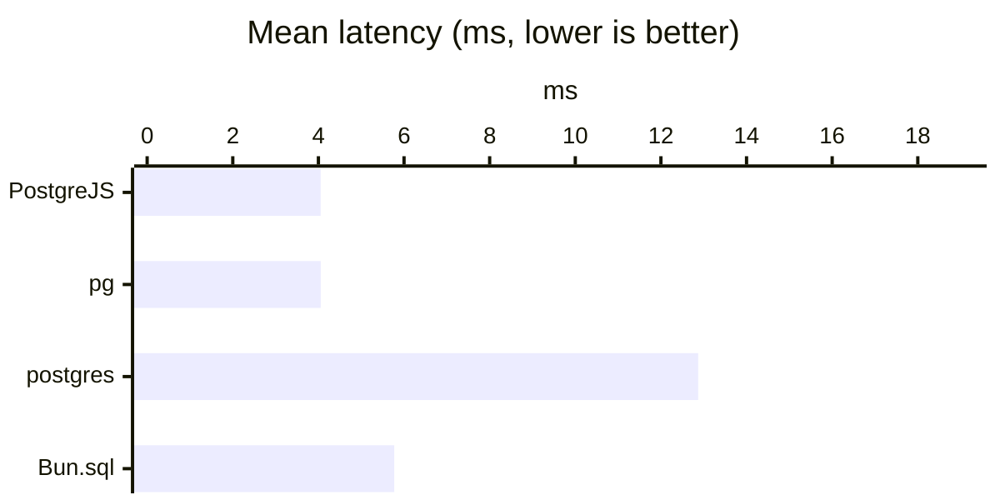

</div>
<div style="display:inline-block;width:430px;vertical-align:top;margin:4px;">

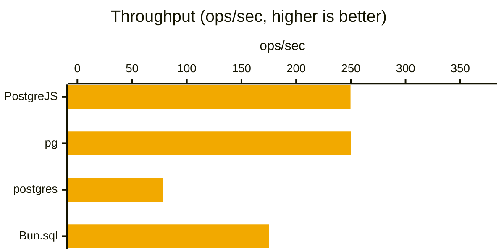

</div>
<div style="display:inline-block;width:430px;vertical-align:top;margin:4px;">

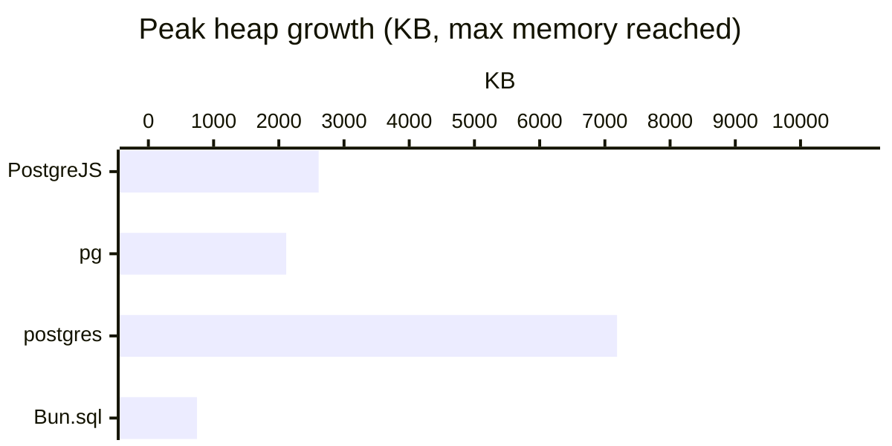

</div>

## Simple Query

PostgreSQL's Simple Query sub-protocol: the client sends the SQL text as a single `Query` (`Q`) message and the server parses, plans, executes, and streams the results back in that same round trip - no separate parse/bind/describe/execute/sync steps, and no query parameters. In postgrejs this is `Connection.execute(sql)`. It's the cheapest way to run a query the client isn't going to reuse, which is why it's also the baseline every other protocol group below is compared against. It's distinct from the Extended Query group below: Extended Query trades this single round trip for several (parse, bind, describe, execute, sync) in exchange for bind parameters and a statement the server can plan once and re-execute. The scenarios here measure that Simple Query round trip three ways: a single query on an otherwise-idle connection, many queries fired concurrently over one connection, and one query that fetches many rows.

### Sequential Execution

Run `select 1` one call at a time on an already-open connection.
Each call is fully awaited before the next one starts.

Every library uses its genuine Simple Query path: PostgreJS's execute(),
pg's query(text) with no params, postgres.js's unsafe() with no args -
always a real Simple Query message, regardless of any prepare option.

This is the baseline for the group: one round trip's plain cost, with no
concurrency, no pooling, and no bind parameters. Compare it against
Concurrent Execution below to see what overlapping calls on the same
connection buys each library.

| Library | Mean (ms) | p75 (ms) | p99 (ms) | ops/sec | vs. slowest | GC (ms/op) | Peak Heap (KB) |
|---|---:|---:|---:|---:|---:|---:|---:|
| PostgreJS (3.5.0) | ***0.211*** | ***0.221*** | 0.500 | ***4915.3*** | ***1.07x*** | — | 3134.10 |
| pg (node-postgres) (8.23.0) | ***0.213*** | ***0.223*** | 0.516 | ***4884.6*** | ***1.06x*** | — | 6615.00 |
| postgres (postgres.js) (3.4.9) | 0.221 | 0.233 | 0.534 | 4718.0 | 1.02x | — | 6621.81 |
| Bun.sql (1.3.10) | 0.225 | 0.239 | ***0.460*** | 4608.9 | 1.00x | — | ***1359.25*** |

<div style="display:inline-block;width:430px;vertical-align:top;margin:4px;">

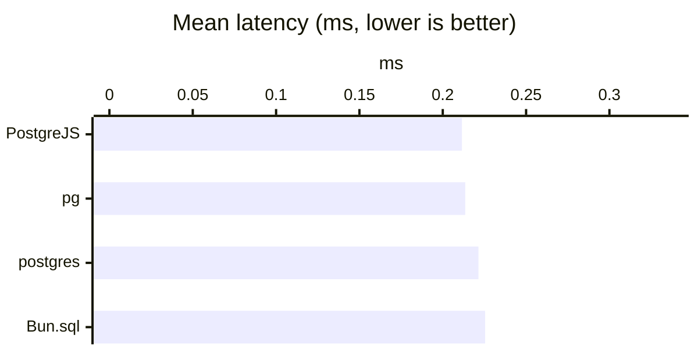

</div>
<div style="display:inline-block;width:430px;vertical-align:top;margin:4px;">

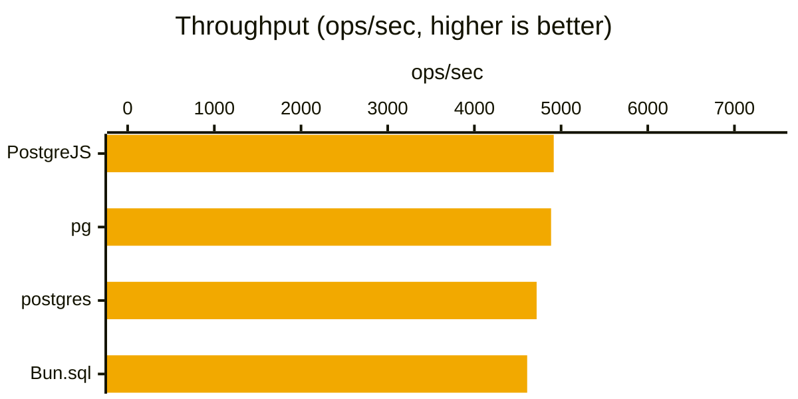

</div>
<div style="display:inline-block;width:430px;vertical-align:top;margin:4px;">

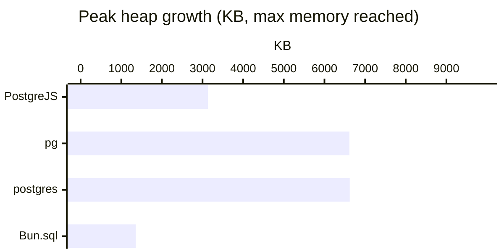

</div>

### Concurrent Execution

The concurrent counterpart to Sequential Execution above. Fire
100 Simple Query calls on the SAME
already-open connection without awaiting each one individually, then await
them all via Promise.all().

PostgreJS pipelines these at the wire level: it writes each message without
waiting for the previous one's response, then matches responses back in
FIFO order, so results never cross-talk even though the caller never
awaited between calls.

Each call selects a distinct literal and checks the result against it, so
this scenario verifies correctness too - do the other libraries' single
connections queue/pipeline correctly? - not just timing. Without distinct
values every response would be interchangeable and a client that matched
them back to the wrong caller would still return a valid row for each,
reporting a fast but wrong number instead of failing.

The distinct literal costs nothing on the server and does not turn this
into a measurement of statement preparation: the Simple Query protocol has
no server-side statement cache, so PostgreSQL parses, rewrites and plans
every Query message it receives even when the text is byte-identical to
the previous one. Measured, 100 concurrent calls with a constant literal
land within noise of the varying one (Node -2.5% to +1.5% across repeats,
Bun +0.3% - the sign flips between runs). Simple Query has no bind
parameters to carry the distinct value instead, which is why this varies
the text where the Extended Query counterpart varies a parameter. (concurrency=100)

| Library | Mean (ms) | p75 (ms) | p99 (ms) | ops/sec | vs. slowest | GC (ms/op) | Peak Heap (KB) |
|---|---:|---:|---:|---:|---:|---:|---:|
| PostgreJS (3.5.0) | ***4.616*** | ***4.814*** | 5.807 | ***218.1*** | ***5.33x*** | — | ***21072.19*** |
| pg (node-postgres) (8.23.0) | ***4.609*** | ***4.743*** | ***5.468*** | ***218.6*** | ***5.33x*** | — | 30452.70 |
| postgres (postgres.js) (3.4.9) | 4.883 | 5.028 | 5.838 | 205.5 | 5.03x | — | 31707.50 |
| Bun.sql (1.3.10) | 24.579 | 25.361 | 38.975 | 41.2 | 1.00x | — | 27416.64 |

<div style="display:inline-block;width:430px;vertical-align:top;margin:4px;">

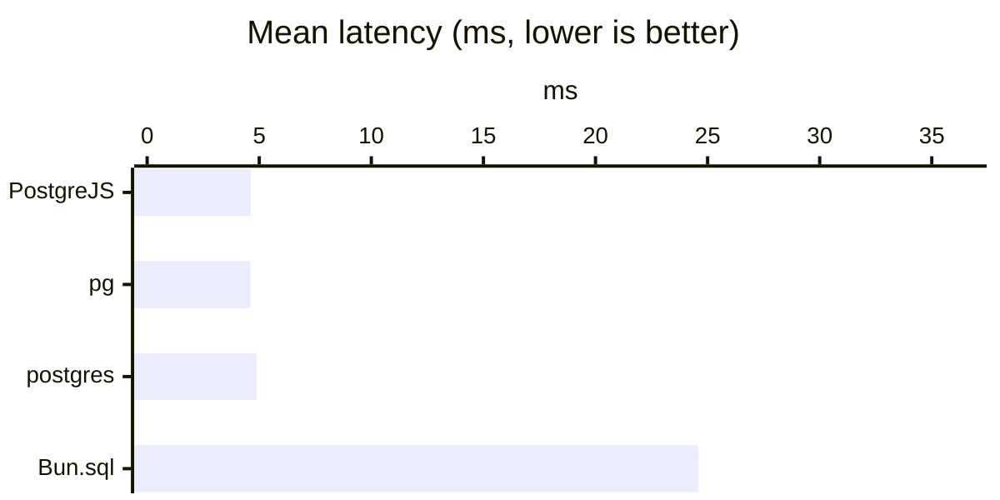

</div>
<div style="display:inline-block;width:430px;vertical-align:top;margin:4px;">

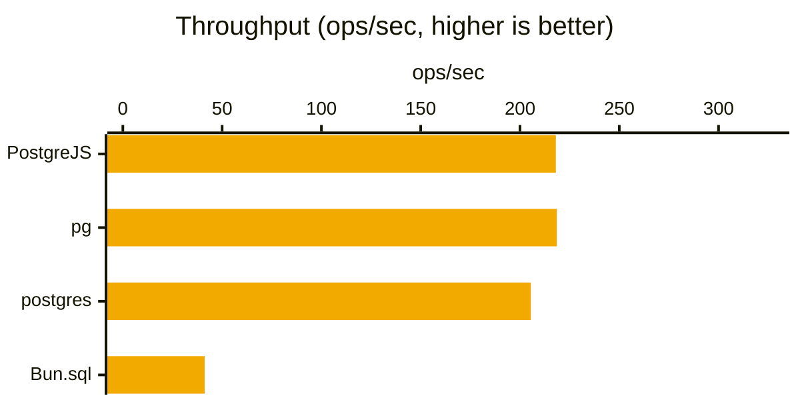

</div>
<div style="display:inline-block;width:430px;vertical-align:top;margin:4px;">

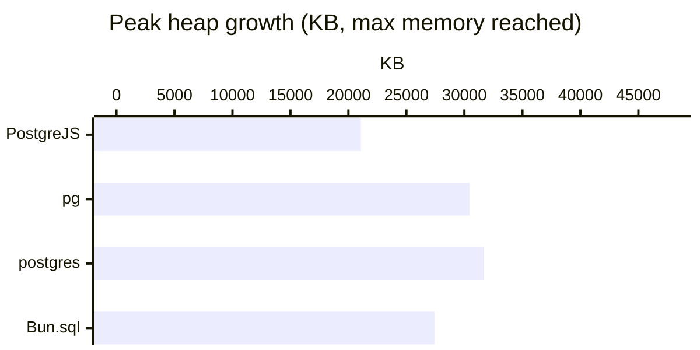

</div>

### Simple Query Fetch

Fetch 1000 mixed-type rows via each
library's Simple Query path - the same protocol as Sequential Execution and
Concurrent Execution above - on a single already-open connection, no pool.
This measures row-fetch throughput without the parse/bind/describe
overhead of the Extended Query protocol.

Excludes int8: pg, postgres.js and PostgreJS return it as genuinely
different JS types by default (string, BigInt, number-or-BigInt). Timing
that column would measure type-conversion choice, not decode speed. (rowTarget=1000)

| Library | Mean (ms) | p75 (ms) | p99 (ms) | ops/sec | vs. slowest | GC (ms/op) | Peak Heap (KB) |
|---|---:|---:|---:|---:|---:|---:|---:|
| PostgreJS (3.5.0) | 1.885 | ***1.909*** | 3.026 | ***541.8*** | 1.42x | — | 51223.30 |
| pg (node-postgres) (8.23.0) | 2.679 | 2.661 | 4.232 | 380.7 | 1.00x | — | 53584.06 |
| postgres (postgres.js) (3.4.9) | 2.669 | 2.710 | 4.802 | 388.6 | 1.00x | — | 53371.86 |
| Bun.sql (1.3.10) | ***1.777*** | ***1.843*** | ***2.301*** | ***567.7*** | ***1.51x*** | — | ***13321.08*** |

<div style="display:inline-block;width:430px;vertical-align:top;margin:4px;">

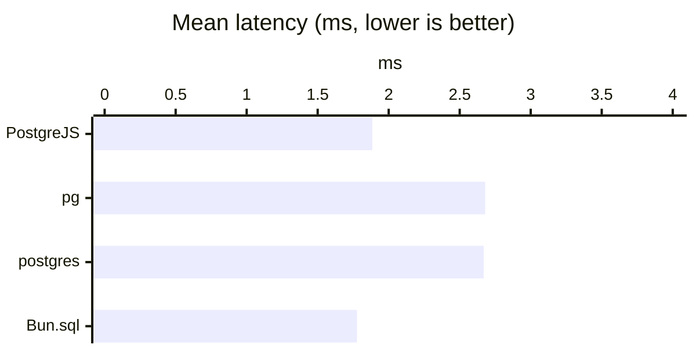

</div>
<div style="display:inline-block;width:430px;vertical-align:top;margin:4px;">

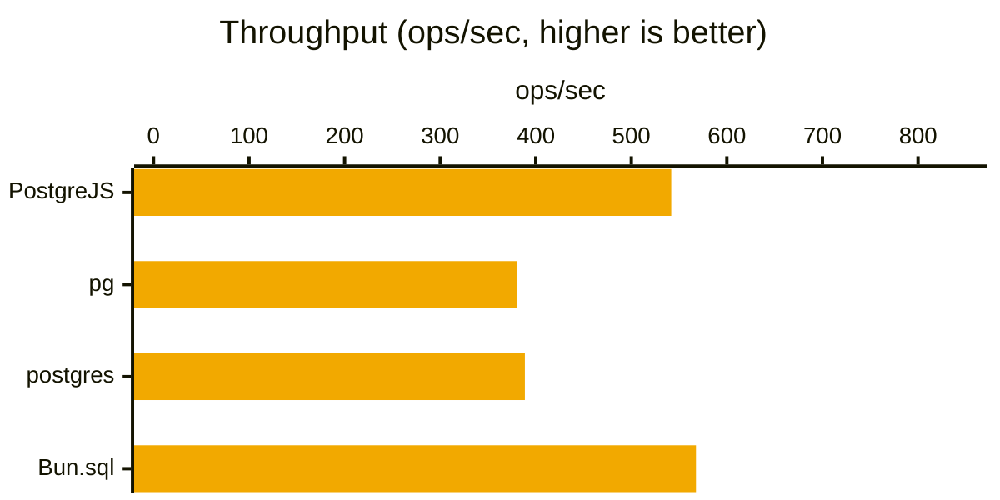

</div>
<div style="display:inline-block;width:430px;vertical-align:top;margin:4px;">

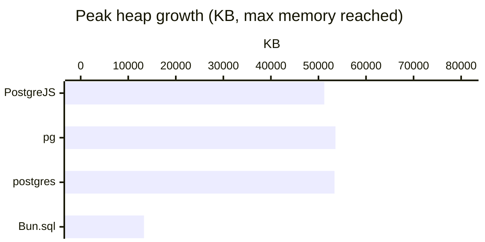

</div>

## Extended Query

PostgreSQL's Extended Query sub-protocol: the client splits a query into separate `Parse`, `Bind`, `Describe`, `Execute`, and `Sync` messages instead of Simple Query's single `Query` message - more wire round trips per query, but it is what makes bind parameters, typed result columns, and a statement the server plans once and can re-execute possible at all (none of that exists in Simple Query). In postgrejs, `Connection.query(sql)` always goes through this path, and `Connection.prepare(sql)` additionally gives back a reusable `PreparedStatement` handle instead of re-sending `Parse` on every call. The scenarios here mirror the Simple Query group's own Sequential/Concurrent pair - a single parameterized call one at a time, then many fired concurrently over one connection - plus decoding many mixed-type rows through `query()` (the row count itself a bind parameter, large enough that decode work dominates the measurement) on both the text and binary wire formats, and the cost this protocol is meant to amortize away: reusing one prepared statement across many executions, sequentially and then concurrently.

### Sequential Execution

The Extended Query counterpart to the Simple Query group's
Sequential Execution above: one already-open connection, one call at a
time, each awaited before the next starts.

Instead of a literal, it selects an int4 value bound as a real query
parameter (`select $1::int4`), so every library genuinely goes through
Parse/Bind/Describe/Execute/Sync rather than a single Query message.

Unlike Prepared Statement Reuse below, there is no reused or cached
server-side statement here, so this isolates the one-shot per-call cost
Extended Query pays on top of the Simple Query baseline. Compare it
against Concurrent Execution below to see what overlapping calls buys
each library here too.

The cast is `int4`, not a narrower integer type, on purpose. Libraries
differ in whether they declare parameter types at all: PostgreJS names an
OID for every parameter in Parse (int4 for a JS number), while pg and
postgres.js send none and let the server infer each one from context. With
a narrower target - `$1::int2` - that difference stops being free: the
server has to wrap PostgreJS's int4 parameter in a runtime cast that the
others never pay for, and this scenario ends up measuring type-declaration
policy rather than Extended Query speed. Measured with a counterbalanced
A/B/B/A run (each library taking both positions in the pair, so ordering
bias cancels - it is worth ~1.4 points here on its own): against pg,
`$1::int2` put PostgreJS 4.3% behind on average, `$1::int4` 0.5%, which
is inside this measurement's noise. Keep the parameter's declared type and
the cast's target the same.

| Library | Mean (ms) | p75 (ms) | p99 (ms) | ops/sec | vs. slowest | GC (ms/op) | Peak Heap (KB) |
|---|---:|---:|---:|---:|---:|---:|---:|
| PostgreJS (3.5.0) | ***0.188*** | ***0.197*** | 0.490 | ***5520.8*** | ***1.17x*** | — | 3479.26 |
| pg (node-postgres) (8.23.0) | 0.220 | 0.229 | 0.532 | 4723.7 | 1.00x | — | 11138.38 |
| postgres (postgres.js) (3.4.9) | ***0.190*** | ***0.198*** | 0.484 | ***5484.3*** | ***1.16x*** | — | 5838.24 |
| Bun.sql (1.3.10) | ***0.197*** | 0.208 | ***0.428*** | ***5253.8*** | ***1.11x*** | — | ***1259.31*** |

<div style="display:inline-block;width:430px;vertical-align:top;margin:4px;">

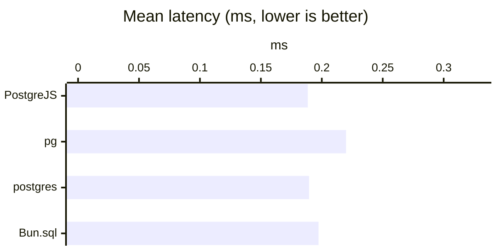

</div>
<div style="display:inline-block;width:430px;vertical-align:top;margin:4px;">

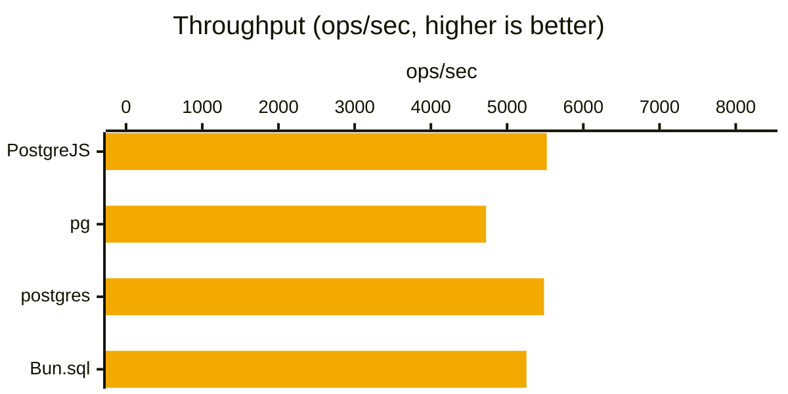

</div>
<div style="display:inline-block;width:430px;vertical-align:top;margin:4px;">

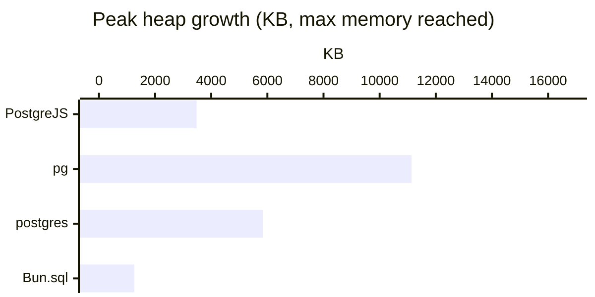

</div>

### Concurrent Execution

The concurrent counterpart to Sequential Execution above, same
shape as the Simple Query group's Concurrent Execution.

Fire 50 genuine Extended Query
calls (`select $1::int4`, a real bind parameter, not a reused/cached
statement) on the SAME already-open connection without awaiting each one
individually, then await them all via Promise.all(). PostgreJS pipelines
these at the wire level, so results never cross-talk even though the
caller never awaited between calls.

Each call binds a distinct value and checks the result against it, so this
scenario verifies correctness too - do the other libraries' single
connections queue/pipeline Extended Query calls correctly? - not just
timing.

The cast is `int4`, not a narrower integer type, on purpose. Libraries
differ in whether they declare parameter types at all: PostgreJS names an
OID for every parameter in Parse (int4 for a JS number), while pg and
postgres.js send none and let the server infer each one from context. With
a narrower target - `$1::int2` - that difference stops being free: the
server has to wrap PostgreJS's int4 parameter in a runtime cast that the
others never pay for, and this scenario ends up measuring type-declaration
policy rather than Extended Query speed. Measured with a counterbalanced
A/B/B/A run (each library taking both positions in the pair, so ordering
bias cancels - it is worth ~1.4 points here on its own): against pg,
`$1::int2` put PostgreJS 4.3% behind on average, `$1::int4` 0.5%, which
is inside this measurement's noise. Keep the parameter's declared type and
the cast's target the same. (concurrency=50)

| Library | Mean (ms) | p75 (ms) | p99 (ms) | ops/sec | vs. slowest | GC (ms/op) | Peak Heap (KB) |
|---|---:|---:|---:|---:|---:|---:|---:|
| PostgreJS (3.5.0) | 0.978 | 1.024 | ***1.574*** | 1043.3 | 2.93x | — | ***21872.71*** |
| pg (node-postgres) (8.23.0) | 2.863 | 2.923 | 4.396 | 355.7 | 1.00x | — | 43731.18 |
| postgres (postgres.js) (3.4.9) | ***0.914*** | ***0.957*** | ***1.576*** | ***1117.6*** | ***3.13x*** | — | 47623.98 |
| Bun.sql (1.3.10) | 1.270 | 1.354 | 2.019 | 807.1 | 2.26x | — | 47388.02 |

<div style="display:inline-block;width:430px;vertical-align:top;margin:4px;">

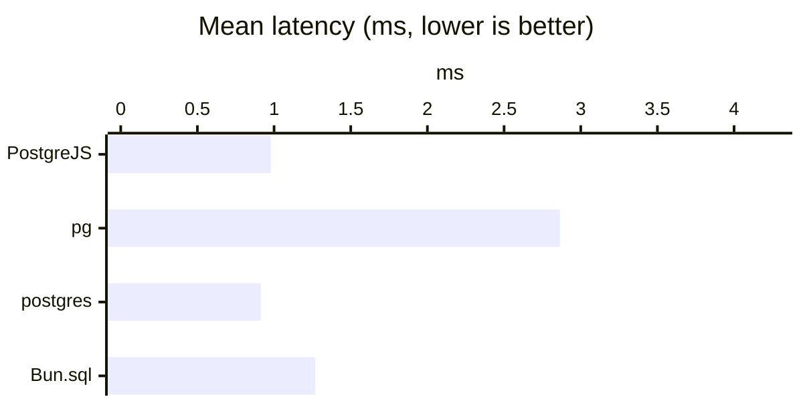

</div>
<div style="display:inline-block;width:430px;vertical-align:top;margin:4px;">

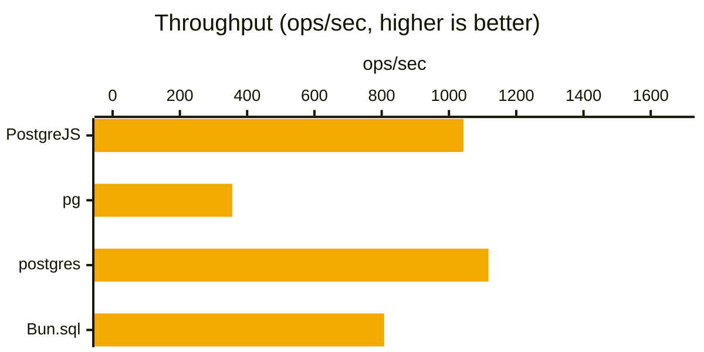

</div>
<div style="display:inline-block;width:430px;vertical-align:top;margin:4px;">

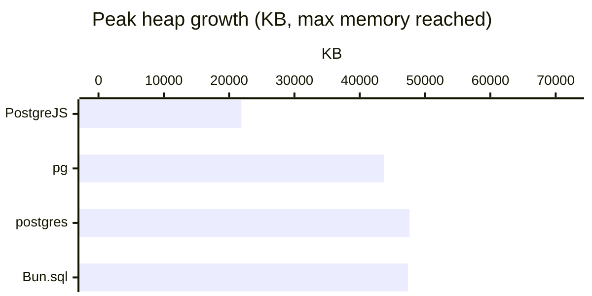

</div>

### Mixed-Type Decode (Text Protocol)

Fetch 1000 mixed-type rows (int2/int4/
float4/float8/varchar/json/jsonb/timestamp/timestamptz/bytea) via each
library's Extended Query path - PostgreJS's query(), a one-shot
parameterized call, not a reused prepared statement - and decode them to
JS values. The row count is itself a real bind parameter ($1), not a
literal, and large enough that column-decode work dominates the
measurement rather than per-call round-trip overhead.

This is the Extended Query counterpart to Simple Query Fetch above: the
raw decode cost this protocol carries per call, before Prepared Statement
Reuse below measures what reusing the parsed plan saves.

Excludes int8: pg, postgres.js and PostgreJS return it as genuinely
different JS types by default (string, BigInt, number-or-BigInt). Timing
that column would measure type-conversion choice, not decode speed.

Forces PostgreJS onto the text protocol explicitly. Its Extended Query
default is binary, per-column, unlike pg and postgres.js, which are always
text here - pg's binary mode is opt-in and never requested, and
postgres.js has no binary protocol support at all. Without that, this
scenario would compare binary decode against text decode, not decode
speed. (rowTarget=1000)

| Library | Mean (ms) | p75 (ms) | p99 (ms) | ops/sec | vs. slowest | GC (ms/op) | Peak Heap (KB) |
|---|---:|---:|---:|---:|---:|---:|---:|
| PostgreJS (3.5.0) | 2.448 | 2.502 | 3.681 | 411.8 | 1.09x | — | 53609.85 |
| pg (node-postgres) (8.23.0) | 2.676 | 2.706 | 4.485 | 381.8 | 1.00x | — | 53882.08 |
| postgres (postgres.js) (3.4.9) | 2.523 | 2.487 | 4.191 | 409.8 | 1.06x | — | 52944.02 |
| Bun.sql (1.3.10) | ***1.281*** | ***1.310*** | ***1.917*** | ***792.1*** | ***2.09x*** | — | ***13042.25*** |

<div style="display:inline-block;width:430px;vertical-align:top;margin:4px;">

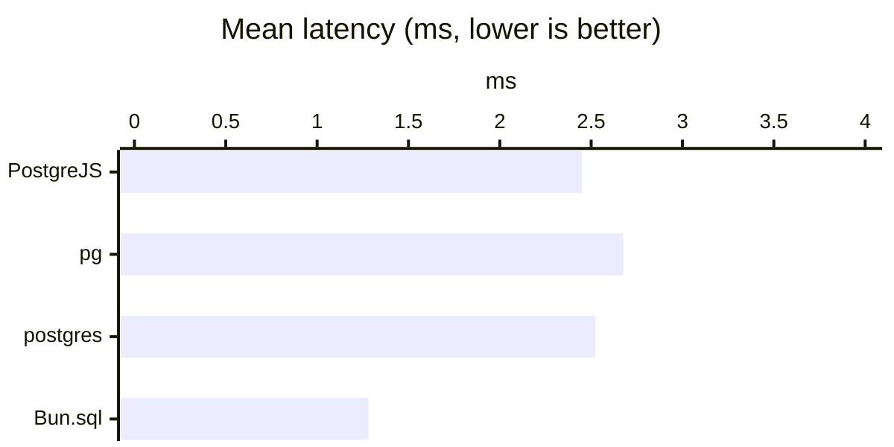

</div>
<div style="display:inline-block;width:430px;vertical-align:top;margin:4px;">

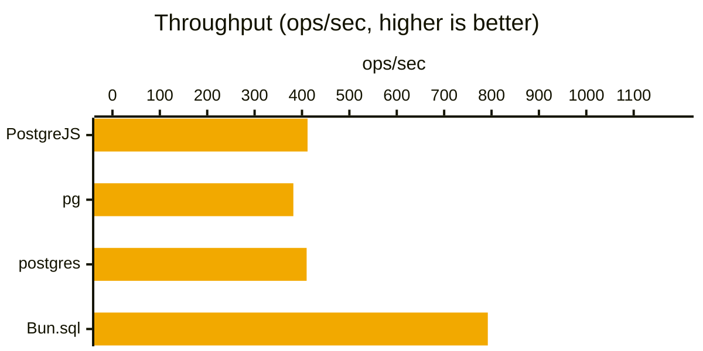

</div>
<div style="display:inline-block;width:430px;vertical-align:top;margin:4px;">

```mermaid
%%{init: {'xyChart': {'width': 600, 'height': 300, 'chartOrientation': 'horizontal'}}}%%
xychart-beta
    title "Peak heap growth (KB, max memory reached)"
    x-axis ["PostgreJS", "pg", "postgres", "Bun.sql"]
    y-axis "KB" 0.0000 --> 80823.1187
    bar [53609.8516, 53882.0791, 52944.0244, 13042.2529]
```

</div>

### Mixed-Type Decode (Binary Protocol)

The same fetch as Mixed-Type Decode (Text Protocol) above - same
1000 rows, same columns, same bind-parameter
row count - but requesting binary result format instead of text. That is
PostgreJS's own Extended Query default (`DEFAULT_COLUMN_FORMAT`), so this
measures its binary decode path on its own terms rather than forcing it
onto text.

postgres.js has no binary protocol support at all: its `Bind` message
hardcodes text format codes for every column, with no option to request
binary (verified in its own source). It isn't benchmarked here.

pg's binary parser table (`pg-types`) is missing exactly the column types
this scenario decodes - `varchar`/`json`/`jsonb`/`bytea` are unregistered
for binary, only a handful of numeric/date/bool types are. Requesting
binary from pg would return those columns unparsed or corrupted rather
than a comparable value, so it's excluded rather than reported as a
misleading number.

Bun's SQL client already uses binary for several of these columns by
default - int4, float4, float8, timestamp, timestamptz, and bytea, verified
by capturing its actual `Bind` message over a logging TCP proxy - but int2,
int8, varchar, json, and jsonb go out as text regardless, a fixed per-type
choice with no exposed option (in the SQL constructor, `.unsafe()`, or the
tagged-template call) to override it either way. Since it can't be forced
into PostgreJS's "request binary for every column" shape, its result here
would be neither this scenario nor a fair text-protocol one - it isn't
benchmarked here for that reason.

Only PostgreJS's own result is shown. (rowTarget=1000)

| Library | Mean (ms) | p75 (ms) | p99 (ms) | ops/sec | vs. slowest | GC (ms/op) | Peak Heap (KB) |
|---|---:|---:|---:|---:|---:|---:|---:|
| PostgreJS (3.5.0) | 2.032 | 2.007 | 3.221 | 507.6 | 1.00x | — | 49871.10 |
| pg (node-postgres) | Not Fully Supported | — | — | — | — | — | — |
| postgres (postgres.js) | Not Supported | — | — | — | — | — | — |
| Bun.sql | Not Controllable | — | — | — | — | — | — |

<div style="display:inline-block;width:430px;vertical-align:top;margin:4px;">

```mermaid
%%{init: {'xyChart': {'width': 600, 'height': 300, 'chartOrientation': 'horizontal'}}}%%
xychart-beta
    title "Mean latency (ms, lower is better)"
    x-axis ["PostgreJS"]
    y-axis "ms" 0.0000 --> 3.0474
    bar [2.0316]
```

</div>
<div style="display:inline-block;width:430px;vertical-align:top;margin:4px;">

```mermaid
%%{init: {'xyChart': {'width': 600, 'height': 300, 'chartOrientation': 'horizontal'}, 'themeVariables': {'xyChart': {'plotColorPalette': '#f2a900'}}}}%%
xychart-beta
    title "Throughput (ops/sec, higher is better)"
    x-axis ["PostgreJS"]
    y-axis "ops/sec" 0.0000 --> 761.3371
    bar [507.5581]
```

</div>
<div style="display:inline-block;width:430px;vertical-align:top;margin:4px;">

```mermaid
%%{init: {'xyChart': {'width': 600, 'height': 300, 'chartOrientation': 'horizontal'}}}%%
xychart-beta
    title "Peak heap growth (KB, max memory reached)"
    x-axis ["PostgreJS"]
    y-axis "KB" 0.0000 --> 74806.6567
    bar [49871.1045]
```

</div>

### Large Blob Fetch

Fetch 10 rows of a
1MB bytea value each
(10MB total)
via each library's Extended Query path, with the row count itself a real
bind parameter, not a literal. The measurement is dominated by
wire-transfer and decode time for a few large values, instead of
per-row/per-column overhead across many small ones - the counterpart to
Mixed-Type Decode above, which is many small values.

Unlike that scenario, no protocol format is forced onto anyone here:
PostgreJS is left on its own Extended Query default (binary), and
pg/postgres.js get whatever their own default is.

postgres.js has no binary protocol support at all (verified elsewhere in
this report), so it always fetches as text - hex-encoded on the wire,
decoded client-side. pg's binary parser table (`pg-types`) has no entry
for `bytea` either (verified live: requesting binary format for a bytea
column returns a corrupted value, not a Buffer) - undocumented and unsafe
to rely on, so pg is left on its own text default too, same as
postgres.js.

Only PostgreJS ends up genuinely exercising a binary fetch; the other two
show their real, best-available path rather than a forced or broken one -
and pay for it. bytea's text format is `\x`-prefixed hex, literally 2x the
wire bytes of binary's raw bytes, so pg and postgres.js transfer twice
what PostgreJS does here. (sizeBytes=1048576, rowCount=10)

| Library | Mean (ms) | p75 (ms) | p99 (ms) | ops/sec | vs. slowest | GC (ms/op) | Peak Heap (KB) | Network (KB/op) |
|---|---:|---:|---:|---:|---:|---:|---:|---:|
| PostgreJS (3.5.0) | ***66.600*** | ***67.362*** | ***68.112*** | ***15.0*** | ***2.04x*** | — | ***50336.83*** | ***12800.16*** |
| pg (node-postgres) (8.23.0) | 131.088 | 132.155 | 136.872 | 7.6 | 1.04x | — | 58007.68 | 25600.23 |
| postgres (postgres.js) (3.4.9) | 136.193 | 137.410 | 140.214 | 7.3 | 1.00x | — | ***52073.50*** | 25600.19 |
| Bun.sql (1.3.10) | 72.444 | ***69.621*** | 113.543 | 14.2 | 1.88x | — | 55497.23 |

<div style="display:inline-block;width:430px;vertical-align:top;margin:4px;">

```mermaid
%%{init: {'xyChart': {'width': 600, 'height': 300, 'chartOrientation': 'horizontal'}}}%%
xychart-beta
    title "Mean latency (ms, lower is better)"
    x-axis ["PostgreJS", "pg", "postgres", "Bun.sql"]
    y-axis "ms" 0.0000 --> 204.2889
    bar [66.6002, 131.0884, 136.1926, 72.4440]
```

</div>
<div style="display:inline-block;width:430px;vertical-align:top;margin:4px;">

```mermaid
%%{init: {'xyChart': {'width': 600, 'height': 300, 'chartOrientation': 'horizontal'}, 'themeVariables': {'xyChart': {'plotColorPalette': '#f2a900'}}}}%%
xychart-beta
    title "Throughput (ops/sec, higher is better)"
    x-axis ["PostgreJS", "pg", "postgres", "Bun.sql"]
    y-axis "ops/sec" 0.0000 --> 22.5280
    bar [15.0187, 7.6303, 7.3444, 14.1988]
```

</div>
<div style="display:inline-block;width:430px;vertical-align:top;margin:4px;">

```mermaid
%%{init: {'xyChart': {'width': 600, 'height': 300, 'chartOrientation': 'horizontal'}}}%%
xychart-beta
    title "Peak heap growth (KB, max memory reached)"
    x-axis ["PostgreJS", "pg", "postgres", "Bun.sql"]
    y-axis "KB" 0.0000 --> 87011.5254
    bar [50336.8262, 58007.6836, 52073.5039, 55497.2344]
```

</div>
<div style="display:inline-block;width:430px;vertical-align:top;margin:4px;">

```mermaid
%%{init: {'xyChart': {'width': 600, 'height': 300, 'chartOrientation': 'horizontal'}}}%%
xychart-beta
    title "Network received (KB/op, lower is better)"
    x-axis ["PostgreJS", "pg", "postgres", "Bun.sql"]
    y-axis "KB/op" 0.0000 --> 38400.3497
    bar [12800.1581, 25600.2332, 25600.1927, 0.0000]
```

</div>

### Large Array Fetch

Fetch 10 rows of an int4[] with
50000 elements each, via each library's Extended
Query path, with the row count itself a real bind parameter, not a
literal. Elements alternate between just below int4's ceiling and just
above its floor, so every value is full-width and roughly half are
negative. Full-width values are what show binary format's real wire
advantage: binary spends a fixed 8 bytes per int4 element, while text
spends one byte per digit.

This is the array counterpart to Large Blob Fetch above (one large scalar
value) and Mixed-Type Decode (many small values): here it is many elements
within a single column value, repeated across rows. Element count, not
byte size, is what drives cost for an array, unlike a blob - see this
file's own comments for the measurement that showed why - so this is
sized for a clear decode-time gap without ballooning each iteration to
whole seconds.

As with Large Blob Fetch, no protocol format is forced onto anyone:
PostgreJS is left on its own Extended Query default (binary).

pg's binary array decode (`pg-types`) is registered-but-buggy rather than
simply unsupported. It does have a registered binary parser for `_int4`
(unlike `bytea`), but that parser reads every element as an unsigned bit
pattern, with no two's-complement handling for negative values. Verified
live: requesting binary format for an int4[] containing negative numbers
returns wrong values from the first negative element onward, and desyncs
the element count entirely on a larger array - a 1500-element array came
back as 1519 elements, values wrong.

So pg is left on its own text default here too, same as postgres.js (no
binary protocol support at all, verified elsewhere in this report). A case
where a library merely having a registered binary parser is not the same
as that parser being safe to use. (elementCount=50000, rowCount=10)

| Library | Mean (ms) | p75 (ms) | p99 (ms) | ops/sec | vs. slowest | GC (ms/op) | Peak Heap (KB) | Network (KB/op) |
|---|---:|---:|---:|---:|---:|---:|---:|---:|
| PostgreJS (3.5.0) | ***30.091*** | ***30.764*** | ***32.863*** | ***33.3*** | ***2.94x*** | — | ***46775.87*** | ***4595.97*** |
| pg (node-postgres) (8.23.0) | 88.485 | 89.163 | 91.180 | 11.3 | 1.00x | — | ***47319.52*** | 7019.26 |
| postgres (postgres.js) (3.4.9) | 56.857 | 57.505 | 58.630 | 17.6 | 1.56x | — | ***47528.42*** | 7019.22 |
| Bun.sql (1.3.10) | 32.100 | 32.440 | ***33.686*** | 31.2 | 2.76x | — | 57636.70 |

<div style="display:inline-block;width:430px;vertical-align:top;margin:4px;">

```mermaid
%%{init: {'xyChart': {'width': 600, 'height': 300, 'chartOrientation': 'horizontal'}}}%%
xychart-beta
    title "Mean latency (ms, lower is better)"
    x-axis ["PostgreJS", "pg", "postgres", "Bun.sql"]
    y-axis "ms" 0.0000 --> 132.7282
    bar [30.0908, 88.4855, 56.8574, 32.1002]
```

</div>
<div style="display:inline-block;width:430px;vertical-align:top;margin:4px;">

```mermaid
%%{init: {'xyChart': {'width': 600, 'height': 300, 'chartOrientation': 'horizontal'}, 'themeVariables': {'xyChart': {'plotColorPalette': '#f2a900'}}}}%%
xychart-beta
    title "Throughput (ops/sec, higher is better)"
    x-axis ["PostgreJS", "pg", "postgres", "Bun.sql"]
    y-axis "ops/sec" 0.0000 --> 49.9032
    bar [33.2688, 11.3045, 17.5923, 31.1634]
```

</div>
<div style="display:inline-block;width:430px;vertical-align:top;margin:4px;">

```mermaid
%%{init: {'xyChart': {'width': 600, 'height': 300, 'chartOrientation': 'horizontal'}}}%%
xychart-beta
    title "Peak heap growth (KB, max memory reached)"
    x-axis ["PostgreJS", "pg", "postgres", "Bun.sql"]
    y-axis "KB" 0.0000 --> 86455.0488
    bar [46775.8721, 47319.5225, 47528.4189, 57636.6992]
```

</div>
<div style="display:inline-block;width:430px;vertical-align:top;margin:4px;">

```mermaid
%%{init: {'xyChart': {'width': 600, 'height': 300, 'chartOrientation': 'horizontal'}}}%%
xychart-beta
    title "Network received (KB/op, lower is better)"
    x-axis ["PostgreJS", "pg", "postgres", "Bun.sql"]
    y-axis "KB/op" 0.0000 --> 10528.8959
    bar [4595.9653, 7019.2639, 7019.2234, 0.0000]
```

</div>

### Prepared Statement Reuse (Sequential)

Prepare once and execute 50 times,
one at a time, each awaited before the next starts. Each library uses its
own prepared-statement mechanism: postgres.js auto-prepares, pg uses a
named statement, PostgreJS uses explicit prepare()/execute()/close().

Compare it against the Concurrent variant below to see what overlapping
executions of the same reused statement buys each library.

Excludes int8: pg, postgres.js and PostgreJS return it as genuinely
different JS types by default (string, BigInt, number-or-BigInt), so
timing it would measure type-conversion choice, not reuse cost. (iterations=50)

| Library | Mean (ms) | p75 (ms) | p99 (ms) | ops/sec | vs. slowest | GC (ms/op) | Peak Heap (KB) |
|---|---:|---:|---:|---:|---:|---:|---:|
| PostgreJS (3.5.0) | ***10.804*** | ***11.091*** | 15.136 | ***93.4*** | ***1.06x*** | — | 4836.56 |
| pg (node-postgres) (8.23.0) | 11.480 | 11.997 | ***13.551*** | 87.5 | 1.00x | — | 15782.67 |
| postgres (postgres.js) (3.4.9) | ***10.616*** | ***10.891*** | ***13.661*** | ***94.4*** | ***1.08x*** | — | 9607.81 |
| Bun.sql (1.3.10) | 11.222 | 11.481 | ***13.217*** | 89.3 | 1.02x | — | ***1347.26*** |

<div style="display:inline-block;width:430px;vertical-align:top;margin:4px;">

```mermaid
%%{init: {'xyChart': {'width': 600, 'height': 300, 'chartOrientation': 'horizontal'}}}%%
xychart-beta
    title "Mean latency (ms, lower is better)"
    x-axis ["PostgreJS", "pg", "postgres", "Bun.sql"]
    y-axis "ms" 0.0000 --> 17.2195
    bar [10.8043, 11.4796, 10.6158, 11.2222]
```

</div>
<div style="display:inline-block;width:430px;vertical-align:top;margin:4px;">

```mermaid
%%{init: {'xyChart': {'width': 600, 'height': 300, 'chartOrientation': 'horizontal'}, 'themeVariables': {'xyChart': {'plotColorPalette': '#f2a900'}}}}%%
xychart-beta
    title "Throughput (ops/sec, higher is better)"
    x-axis ["PostgreJS", "pg", "postgres", "Bun.sql"]
    y-axis "ops/sec" 0.0000 --> 141.6102
    bar [93.3970, 87.5347, 94.4068, 89.3087]
```

</div>
<div style="display:inline-block;width:430px;vertical-align:top;margin:4px;">

```mermaid
%%{init: {'xyChart': {'width': 600, 'height': 300, 'chartOrientation': 'horizontal'}}}%%
xychart-beta
    title "Peak heap growth (KB, max memory reached)"
    x-axis ["PostgreJS", "pg", "postgres", "Bun.sql"]
    y-axis "KB" 0.0000 --> 23673.9990
    bar [4836.5605, 15782.6660, 9607.8115, 1347.2588]
```

</div>

### Prepared Statement Reuse (Concurrent)

The concurrent counterpart to Sequential above: prepare once,
then fire 50 executions of
that same reused statement on the SAME already-open connection without
awaiting each one individually, then await them all via Promise.all().

Each library uses its own prepared-statement mechanism: postgres.js
auto-prepares, pg uses a named statement, PostgreJS uses explicit
prepare()/execute()/close().

Excludes int8: pg, postgres.js and PostgreJS return it as genuinely
different JS types by default (string, BigInt, number-or-BigInt), so
timing it would measure type-conversion choice, not reuse cost. (concurrency=50)

| Library | Mean (ms) | p75 (ms) | p99 (ms) | ops/sec | vs. slowest | GC (ms/op) | Peak Heap (KB) |
|---|---:|---:|---:|---:|---:|---:|---:|
| PostgreJS (3.5.0) | ***2.319*** | ***2.403*** | 3.938 | ***438.2*** | ***1.16x*** | — | ***25765.22*** |
| pg (node-postgres) (8.23.0) | ***2.310*** | ***2.414*** | ***3.104*** | ***436.8*** | ***1.17x*** | — | 56126.87 |
| postgres (postgres.js) (3.4.9) | ***2.245*** | ***2.326*** | ***3.233*** | ***450.1*** | ***1.20x*** | — | 40153.25 |
| Bun.sql (1.3.10) | 2.699 | 2.819 | 3.386 | 373.0 | 1.00x | — | 40386.06 |

<div style="display:inline-block;width:430px;vertical-align:top;margin:4px;">

```mermaid
%%{init: {'xyChart': {'width': 600, 'height': 300, 'chartOrientation': 'horizontal'}}}%%
xychart-beta
    title "Mean latency (ms, lower is better)"
    x-axis ["PostgreJS", "pg", "postgres", "Bun.sql"]
    y-axis "ms" 0.0000 --> 4.0489
    bar [2.3189, 2.3102, 2.2449, 2.6993]
```

</div>
<div style="display:inline-block;width:430px;vertical-align:top;margin:4px;">

```mermaid
%%{init: {'xyChart': {'width': 600, 'height': 300, 'chartOrientation': 'horizontal'}, 'themeVariables': {'xyChart': {'plotColorPalette': '#f2a900'}}}}%%
xychart-beta
    title "Throughput (ops/sec, higher is better)"
    x-axis ["PostgreJS", "pg", "postgres", "Bun.sql"]
    y-axis "ops/sec" 0.0000 --> 675.0979
    bar [438.2309, 436.7893, 450.0653, 372.9873]
```

</div>
<div style="display:inline-block;width:430px;vertical-align:top;margin:4px;">

```mermaid
%%{init: {'xyChart': {'width': 600, 'height': 300, 'chartOrientation': 'horizontal'}}}%%
xychart-beta
    title "Peak heap growth (KB, max memory reached)"
    x-axis ["PostgreJS", "pg", "postgres", "Bun.sql"]
    y-axis "KB" 0.0000 --> 84190.3037
    bar [25765.2188, 56126.8691, 40153.2549, 40386.0586]
```

</div>

## Unit of Work

Several different statements run as one unit, the shape a single request usually has - a few writes, a few reads, none of them repeating. Every library sends them without waiting between replies, which all three can do; what separates them is whether each statement still costs its own `Sync`, and with it a round of the server's implicit-transaction bookkeeping. Distinct from the Concurrent Execution scenarios above, where the same query is fired many times and a parsed plan can be shared.

### Unit of Work

Runs 20 different statements - ten writes, five
reads, then five more writes - as one unit, the shape a single request
usually has. Unlike the Concurrent Execution scenarios, which fire the same
query many times, every statement here is different, so none of them can
share a parsed plan with another.

Each library uses the fastest path it has for this. pg and postgres.js fire
the statements through `Promise.all()` without awaiting between them, which
is genuinely their best: both pipeline, so the statements travel without
waiting for each other's replies. postgres.js builds them from its tagged
template rather than `sql.unsafe()` - on this workload that is 3.5x faster
for it (4.4ms against 15.5ms), so the `$1` form would have measured a path
its users have no reason to take. PostgreJS uses `pipeline()`, which goes
one step further and closes all twenty with a single `Sync` instead of one
each.

That last step is what the scenario is really measuring, and it is not a
configuration difference: a `Sync` per statement makes the server finish an
implicit transaction and answer ReadyForQuery every time, and neither other
driver can avoid it - pg sends one immediately after each Execute, and
postgres.js concatenates Execute and Sync into a single constant, so the
two cannot come apart. Compare against Concurrent Execution (Extended
Query) above to see the same libraries running the same number of calls
when the statements are identical rather than different. (statementCount=20)

| Library | Mean (ms) | p75 (ms) | p99 (ms) | ops/sec | vs. slowest | GC (ms/op) | Peak Heap (KB) |
|---|---:|---:|---:|---:|---:|---:|---:|
| PostgreJS (3.5.0) | ***0.876*** | ***0.877*** | ***1.928*** | ***1215.8*** | ***4.99x*** | — | ***6947.90*** |
| pg (node-postgres) (8.23.0) | 4.367 | 4.404 | 7.550 | 233.1 | 1.00x | — | 14110.39 |
| postgres (postgres.js) (3.4.9) | 2.991 | 3.052 | 3.759 | 335.9 | 1.46x | — | 9041.37 |
| Bun.sql (1.3.10) | 3.683 | 3.690 | 4.667 | 274.8 | 1.19x | — | 12535.96 |

<div style="display:inline-block;width:430px;vertical-align:top;margin:4px;">

```mermaid
%%{init: {'xyChart': {'width': 600, 'height': 300, 'chartOrientation': 'horizontal'}}}%%
xychart-beta
    title "Mean latency (ms, lower is better)"
    x-axis ["PostgreJS", "pg", "postgres", "Bun.sql"]
    y-axis "ms" 0.0000 --> 6.5508
    bar [0.8758, 4.3672, 2.9914, 3.6835]
```

</div>
<div style="display:inline-block;width:430px;vertical-align:top;margin:4px;">

```mermaid
%%{init: {'xyChart': {'width': 600, 'height': 300, 'chartOrientation': 'horizontal'}, 'themeVariables': {'xyChart': {'plotColorPalette': '#f2a900'}}}}%%
xychart-beta
    title "Throughput (ops/sec, higher is better)"
    x-axis ["PostgreJS", "pg", "postgres", "Bun.sql"]
    y-axis "ops/sec" 0.0000 --> 1823.6427
    bar [1215.7618, 233.0657, 335.8916, 274.7799]
```

</div>
<div style="display:inline-block;width:430px;vertical-align:top;margin:4px;">

```mermaid
%%{init: {'xyChart': {'width': 600, 'height': 300, 'chartOrientation': 'horizontal'}}}%%
xychart-beta
    title "Peak heap growth (KB, max memory reached)"
    x-axis ["PostgreJS", "pg", "postgres", "Bun.sql"]
    y-axis "KB" 0.0000 --> 21165.5845
    bar [6947.8955, 14110.3896, 9041.3662, 12535.9648]
```

</div>

## Bulk Load

`COPY ... FROM STDIN`, the path PostgreSQL optimises for writing many rows at once - one statement carrying a stream of rows instead of an INSERT per row or a bind per row. The two scenarios are the same 200,000 rows sent two ways: as CSV every library formats itself, and as the binary COPY format only PostgreJS can produce. Read them together - the text table is what separates the drivers, and the difference between the tables is what the format buys. Both scenarios truncate the destination inside the timed call and start from the same materialised rows, so each library pays for its own formatting rather than being handed a payload someone else built.

### Bulk Load (text COPY)

Bulk-loads 200,000 rows into an empty table over
`COPY ... FROM STDIN`, the path PostgreSQL itself optimises for bulk
writes. Each iteration truncates the destination first, so every run loads
into the same empty table - the truncate is inside the timed call and
costs every library the same.

Column values hug each type's widest text form, the same choice the seeded
tables make: binary costs a fixed number of bytes per column whatever the
value is, while text costs one per character, so a payload of small numbers
would understate the format difference and unusually long ones would
overstate it.

That choice moves the headline enough to state outright. On these same
200,000 rows, text against binary: with these values (10-digit int4,
19-digit int8, widest float8, 40-char varchar) 2495ms against 242ms, a
10.3x gap over ~22MB of CSV; with single-digit numbers and 4-char strings
instead, 497ms against 187ms, a 2.7x gap over ~8MB. Both are honest for
their own data and neither is universal - binary's cost per column doesn't
move between those runs, what changes is how much text the server has to
parse. Place the table against your own rows rather than reading one figure
as the answer.

This is the like-for-like comparison: every library formats the same CSV
payload and streams it as bytes, which is the only thing pg and
postgres.js can do (see Bulk Load (binary COPY) below). PostgreJS uses its
own `copyFrom()` byte stream here rather than `copyFromRows()`, so what
is measured is the driver's COPY transport, not the format.

pg needs `pg-copy-streams` for this at all - its core `Query` refuses
COPY IN - which is installed here so it runs its real path rather than
being marked unsupported. (rowCount=200000)

| Library | Mean (ms) | p75 (ms) | p99 (ms) | ops/sec | vs. slowest | GC (ms/op) | Peak Heap (KB) |
|---|---:|---:|---:|---:|---:|---:|---:|
| PostgreJS (3.5.0) | ***2272.979*** | 2294.568 | ***2411.325*** | ***0.4*** | ***1.01x*** | — | ***96338.63*** |
| pg (node-postgres) (8.23.0) | ***2290.868*** | ***2263.682*** | ***2441.183*** | ***0.4*** | ***1.00x*** | — | ***95890.76*** |
| postgres (postgres.js) (3.4.9) | ***2275.023*** | ***2238.989*** | ***2473.924*** | ***0.4*** | ***1.01x*** | — | 119224.98 |
| Bun.sql | No COPY API | — | — | — | — | — | — |

<div style="display:inline-block;width:430px;vertical-align:top;margin:4px;">

```mermaid
%%{init: {'xyChart': {'width': 600, 'height': 300, 'chartOrientation': 'horizontal'}}}%%
xychart-beta
    title "Mean latency (ms, lower is better)"
    x-axis ["PostgreJS", "pg", "postgres"]
    y-axis "ms" 0.0000 --> 3436.3023
    bar [2272.9790, 2290.8682, 2275.0232]
```

</div>
<div style="display:inline-block;width:430px;vertical-align:top;margin:4px;">

```mermaid
%%{init: {'xyChart': {'width': 600, 'height': 300, 'chartOrientation': 'horizontal'}, 'themeVariables': {'xyChart': {'plotColorPalette': '#f2a900'}}}}%%
xychart-beta
    title "Throughput (ops/sec, higher is better)"
    x-axis ["PostgreJS", "pg", "postgres"]
    y-axis "ops/sec" 0.0000 --> 0.6607
    bar [0.4405, 0.4371, 0.4404]
```

</div>
<div style="display:inline-block;width:430px;vertical-align:top;margin:4px;">

```mermaid
%%{init: {'xyChart': {'width': 600, 'height': 300, 'chartOrientation': 'horizontal'}}}%%
xychart-beta
    title "Peak heap growth (KB, max memory reached)"
    x-axis ["PostgreJS", "pg", "postgres"]
    y-axis "KB" 0.0000 --> 178837.4678
    bar [96338.6348, 95890.7617, 119224.9785]
```

</div>

### Bulk Load (binary COPY)

Bulk-loads 200,000 rows into an empty table over
`COPY ... FROM STDIN`, the path PostgreSQL itself optimises for bulk
writes. Each iteration truncates the destination first, so every run loads
into the same empty table - the truncate is inside the timed call and
costs every library the same.

Column values hug each type's widest text form, the same choice the seeded
tables make: binary costs a fixed number of bytes per column whatever the
value is, while text costs one per character, so a payload of small numbers
would understate the format difference and unusually long ones would
overstate it.

That choice moves the headline enough to state outright. On these same
200,000 rows, text against binary: with these values (10-digit int4,
19-digit int8, widest float8, 40-char varchar) 2495ms against 242ms, a
10.3x gap over ~22MB of CSV; with single-digit numbers and 4-char strings
instead, 497ms against 187ms, a 2.7x gap over ~8MB. Both are honest for
their own data and neither is universal - binary's cost per column doesn't
move between those runs, what changes is how much text the server has to
parse. Place the table against your own rows rather than reading one figure
as the answer.

The same rows as Bulk Load (text COPY) above, loaded through PostgreJS's
`copyFromRows()`, which encodes them into PostgreSQL's binary COPY format
instead of CSV. Read the two tables together: the difference between them
is what the format buys, while the text table alone is what separates the
drivers.

pg and postgres.js are absent because neither can produce the format.
Both can carry a binary COPY payload the caller has already encoded - so
this is not a missing transport - but producing it needs a binary encoder
per type, which neither has. For pg a third-party package,
`pg-copy-streams-binary`, supplies its own encoders; it is left out here
for the same reason `pg-native` is, being outside the driver rather than
part of it. (rowCount=200000)

| Library | Mean (ms) | p75 (ms) | p99 (ms) | ops/sec | vs. slowest | GC (ms/op) | Peak Heap (KB) |
|---|---:|---:|---:|---:|---:|---:|---:|
| PostgreJS (3.5.0) | 195.348 | 198.500 | 240.912 | 5.2 | 1.00x | — | 109379.04 |
| pg (node-postgres) | No binary COPY encoding | — | — | — | — | — | — |
| postgres (postgres.js) | No binary COPY encoding | — | — | — | — | — | — |
| Bun.sql | No COPY API | — | — | — | — | — | — |

<div style="display:inline-block;width:430px;vertical-align:top;margin:4px;">

```mermaid
%%{init: {'xyChart': {'width': 600, 'height': 300, 'chartOrientation': 'horizontal'}}}%%
xychart-beta
    title "Mean latency (ms, lower is better)"
    x-axis ["PostgreJS"]
    y-axis "ms" 0.0000 --> 293.0224
    bar [195.3483]
```

</div>
<div style="display:inline-block;width:430px;vertical-align:top;margin:4px;">

```mermaid
%%{init: {'xyChart': {'width': 600, 'height': 300, 'chartOrientation': 'horizontal'}, 'themeVariables': {'xyChart': {'plotColorPalette': '#f2a900'}}}}%%
xychart-beta
    title "Throughput (ops/sec, higher is better)"
    x-axis ["PostgreJS"]
    y-axis "ops/sec" 0.0000 --> 7.7565
    bar [5.1710]
```

</div>
<div style="display:inline-block;width:430px;vertical-align:top;margin:4px;">

```mermaid
%%{init: {'xyChart': {'width': 600, 'height': 300, 'chartOrientation': 'horizontal'}}}%%
xychart-beta
    title "Peak heap growth (KB, max memory reached)"
    x-axis ["PostgreJS"]
    y-axis "KB" 0.0000 --> 164068.5601
    bar [109379.0400]
```

</div>

## Cursor Streaming

A server-side cursor (postgrejs's `Connection.query(sql, { cursor: true })`) fetches rows in bounded batches via repeated Extended Query `Execute` calls against a portal, instead of the server materializing and sending the whole result set at once. The relevant metric when a result set doesn't comfortably fit in memory, not raw single-shot throughput.

### Cursor Streaming

Stream 50000 rows via a server-side cursor in batches of 500.
Excludes int8: pg/postgres.js/PostgreJS return it as genuinely different JS types by default (string/BigInt/number-or-BigInt),
so timing it would measure type-conversion choice, not streaming throughput.

Bun's SQL client has no cursor/streaming API at all - no `.cursor()`, no
`.forEach()`, no `Symbol.asyncIterator` on a query (verified against its
own type declarations and empirically). It isn't benchmarked here. (rowTarget=50000, batchSize=500)

| Library | Mean (ms) | p75 (ms) | p99 (ms) | ops/sec | vs. slowest | GC (ms/op) | Peak Heap (KB) |
|---|---:|---:|---:|---:|---:|---:|---:|
| PostgreJS (3.5.0) | ***139.049*** | 141.830 | 145.075 | ***7.2*** | ***1.18x*** | — | ***53081.70*** |
| pg (node-postgres) (8.23.0) | 163.909 | 162.918 | 171.546 | 6.1 | 1.00x | — | ***53627.66*** |
| postgres (postgres.js) (3.4.9) | ***137.860*** | ***138.061*** | ***141.956*** | ***7.3*** | ***1.19x*** | — | 54689.47 |
| Bun.sql | Not Supported | — | — | — | — | — | — |

<div style="display:inline-block;width:430px;vertical-align:top;margin:4px;">

```mermaid
%%{init: {'xyChart': {'width': 600, 'height': 300, 'chartOrientation': 'horizontal'}}}%%
xychart-beta
    title "Mean latency (ms, lower is better)"
    x-axis ["PostgreJS", "pg", "postgres"]
    y-axis "ms" 0.0000 --> 245.8633
    bar [139.0493, 163.9089, 137.8602]
```

</div>
<div style="display:inline-block;width:430px;vertical-align:top;margin:4px;">

```mermaid
%%{init: {'xyChart': {'width': 600, 'height': 300, 'chartOrientation': 'horizontal'}, 'themeVariables': {'xyChart': {'plotColorPalette': '#f2a900'}}}}%%
xychart-beta
    title "Throughput (ops/sec, higher is better)"
    x-axis ["PostgreJS", "pg", "postgres"]
    y-axis "ops/sec" 0.0000 --> 10.8832
    bar [7.1972, 6.1191, 7.2555]
```

</div>
<div style="display:inline-block;width:430px;vertical-align:top;margin:4px;">

```mermaid
%%{init: {'xyChart': {'width': 600, 'height': 300, 'chartOrientation': 'horizontal'}}}%%
xychart-beta
    title "Peak heap growth (KB, max memory reached)"
    x-axis ["PostgreJS", "pg", "postgres"]
    y-axis "KB" 0.0000 --> 82034.2119
    bar [53081.7012, 53627.6641, 54689.4746]
```

</div>

## Connection Pooling

The overhead each library's connection pool adds on top of the raw per-query costs measured above: running many queries concurrently through a shared pool (postgrejs's `Pool.query()`), and isolating the pure cost of acquiring and releasing a pooled connection from the cost of the query itself.

### Pooled Simple Query

Same query as Sequential Execution/Concurrent Execution above,
run through a pool instead of a single open connection:
1000 concurrent `select 1 as one`
queries against a pool of max size 10,
using each library's own top-level pooled entry point. (concurrency=1000, poolSize=10)

| Library | Mean (ms) | p75 (ms) | p99 (ms) | ops/sec | vs. slowest | GC (ms/op) | Peak Heap (KB) |
|---|---:|---:|---:|---:|---:|---:|---:|
| PostgreJS (3.5.0) | ***12.578*** | ***13.171*** | ***22.117*** | ***82.3*** | ***4.56x*** | — | 56774.01 |
| pg (node-postgres) (8.23.0) | 52.255 | 54.294 | 66.783 | 19.3 | 1.10x | — | ***32757.23*** |
| postgres (postgres.js) (3.4.9) | 15.385 | 16.859 | 27.771 | 67.2 | 3.73x | — | 57702.26 |
| Bun.sql (1.3.10) | 57.348 | 57.813 | 70.107 | 17.5 | 1.00x | — | 35990.84 |

<div style="display:inline-block;width:430px;vertical-align:top;margin:4px;">

```mermaid
%%{init: {'xyChart': {'width': 600, 'height': 300, 'chartOrientation': 'horizontal'}}}%%
xychart-beta
    title "Mean latency (ms, lower is better)"
    x-axis ["PostgreJS", "pg", "postgres", "Bun.sql"]
    y-axis "ms" 0.0000 --> 86.0223
    bar [12.5785, 52.2554, 15.3846, 57.3482]
```

</div>
<div style="display:inline-block;width:430px;vertical-align:top;margin:4px;">

```mermaid
%%{init: {'xyChart': {'width': 600, 'height': 300, 'chartOrientation': 'horizontal'}, 'themeVariables': {'xyChart': {'plotColorPalette': '#f2a900'}}}}%%
xychart-beta
    title "Throughput (ops/sec, higher is better)"
    x-axis ["PostgreJS", "pg", "postgres", "Bun.sql"]
    y-axis "ops/sec" 0.0000 --> 123.3864
    bar [82.2576, 19.2809, 67.2312, 17.5208]
```

</div>
<div style="display:inline-block;width:430px;vertical-align:top;margin:4px;">

```mermaid
%%{init: {'xyChart': {'width': 600, 'height': 300, 'chartOrientation': 'horizontal'}}}%%
xychart-beta
    title "Peak heap growth (KB, max memory reached)"
    x-axis ["PostgreJS", "pg", "postgres", "Bun.sql"]
    y-axis "KB" 0.0000 --> 86553.3926
    bar [56774.0098, 32757.2305, 57702.2617, 35990.8359]
```

</div>

### Pooled Extended Query

The Extended Query counterpart to Pooled Simple Query above: the
same 1000 concurrent calls against a
pool of max size 10, but binding a
real query parameter (`select $1::int4 as one`) so every library goes
through Parse/Bind/Describe/Execute/Sync instead of a single Query
message.

Each call is a one-shot statement, not a reused prepared one, so this
shows what a pool costs on top of the per-call Extended Query overhead.
Compare it against this group's Pooled Simple Query to see what the extra
protocol round of messages adds once connections are being shared.

Read the margin here with that one-shot constraint in mind. postgres.js's
unprepared path (`sql.unsafe(query, args)`, the same call the
single-connection Sequential Execution scenario uses, where it comes out
ahead) does not pipeline a burst the way its prepared path does. Letting
it cache the statement instead turns this into a different measurement
entirely, which is what Prepared Statement Reuse below covers. (concurrency=1000, poolSize=10)

| Library | Mean (ms) | p75 (ms) | p99 (ms) | ops/sec | vs. slowest | GC (ms/op) | Peak Heap (KB) |
|---|---:|---:|---:|---:|---:|---:|---:|
| PostgreJS (3.5.0) | 13.442 | 13.367 | 35.334 | 78.6 | 4.05x | — | ***39427.21*** |
| pg (node-postgres) (8.23.0) | 54.430 | 53.487 | 68.526 | 18.5 | 1.00x | — | 46638.43 |
| postgres (postgres.js) (3.4.9) | ***11.871*** | ***12.776*** | ***20.033*** | ***88.1*** | ***4.58x*** | — | 56764.67 |
| Bun.sql (1.3.10) | 17.730 | 17.795 | 36.109 | 67.9 | 3.07x | — | 58012.79 |

<div style="display:inline-block;width:430px;vertical-align:top;margin:4px;">

```mermaid
%%{init: {'xyChart': {'width': 600, 'height': 300, 'chartOrientation': 'horizontal'}}}%%
xychart-beta
    title "Mean latency (ms, lower is better)"
    x-axis ["PostgreJS", "pg", "postgres", "Bun.sql"]
    y-axis "ms" 0.0000 --> 81.6445
    bar [13.4424, 54.4297, 11.8714, 17.7300]
```

</div>
<div style="display:inline-block;width:430px;vertical-align:top;margin:4px;">

```mermaid
%%{init: {'xyChart': {'width': 600, 'height': 300, 'chartOrientation': 'horizontal'}, 'themeVariables': {'xyChart': {'plotColorPalette': '#f2a900'}}}}%%
xychart-beta
    title "Throughput (ops/sec, higher is better)"
    x-axis ["PostgreJS", "pg", "postgres", "Bun.sql"]
    y-axis "ops/sec" 0.0000 --> 132.1283
    bar [78.5656, 18.5362, 88.0855, 67.9015]
```

</div>
<div style="display:inline-block;width:430px;vertical-align:top;margin:4px;">

```mermaid
%%{init: {'xyChart': {'width': 600, 'height': 300, 'chartOrientation': 'horizontal'}}}%%
xychart-beta
    title "Peak heap growth (KB, max memory reached)"
    x-axis ["PostgreJS", "pg", "postgres", "Bun.sql"]
    y-axis "KB" 0.0000 --> 87019.1807
    bar [39427.2148, 46638.4326, 56764.6709, 58012.7871]
```

</div>

## Raw data

Backing raw data for the numbers above lives in `benchmark/results/bun/*.json` (gitignored; regenerate with `npm run bench:bun`).
